# 3D GALAXY
## ADMIN PORTAL — STANDARD OPERATING PROCEDURE (SOP)
### Complete Administration, Configuration & Operations Guide

```
========================================================================================
                          CLIENT HANDOVER & OPERATIONS MANUAL
                        AJR DIGITAL HUB  ──►  3D GALAXY TEAM
========================================================================================
```

<p align="center">
  
  &nbsp;&nbsp;&nbsp;&nbsp;&nbsp;&nbsp;&nbsp;&nbsp;
  
</p>
<p align="center">
  <strong>DELIVERED BY:</strong> AJR Digital Hub Team &nbsp;&nbsp;➔&nbsp;&nbsp; <strong>ACCEPTED BY:</strong> 3D Galaxy Team
</p>

---

## DOCUMENT CONTROL & GOVERNANCE

| Document Attribute | Specification Details |
| :--- | :--- |
| **Document Title** | 3D Galaxy Admin Portal — Standard Operating Procedure (SOP) |
| **Application Platform** | 3D Galaxy Enterprise E-Commerce & Custom Manufacturing Portal |
| **Document Type** | Client Handover Document / Operational SOP |
| **Document Identifier** | SOP-3DG-ADM-2026-V1.0 |
| **Release Version** | 1.0 (Production Master) |
| **Publication Date** | September 2026 |
| **Document Status** | Client Review / Handover Complete |
| **Classification** | Commercial in Confidence — Client Operational Manual |
| **Delivered By** | **AJR Digital Hub Team** (Enterprise Digital Solutions Team) |
| **Delivered To / Accepted By** | **3D Galaxy Team** (E-Commerce Operations & Store Administration) |
| **Target Audience** | Store Administrators, Inventory Managers, Fulfillment Officers, Support Leads |

### Handover Responsibility Matrix

```
       ┌────────────────────────────────────────────────────────┐
       │                  AJR DIGITAL HUB                       │
       │        Enterprise Digital Solutions Team               │
       │    (Engineering, Architecture & Platform Delivery)     │
       └───────────────────────────┬────────────────────────────┘
                                   │
                                   ▼  [Delivers & Hands Over]
       ┌────────────────────────────────────────────────────────┐
       │                     3D GALAXY                          │
       │        E-Commerce Operations & Administration          │
       │    (Catalog Management, Fulfillment & Store Ops)       │
       └───────────────────────────┬────────────────────────────┘
                                   │
                                   ▼  [Executes Day-to-Day]
       ┌────────────────────────────────────────────────────────┐
       │              3D GALAXY ADMIN OPERATIONS                │
       │   • Catalog & Products   • Inventory & Variants        │
       │   • Logistics & Orders   • Customer Omnichannel Comm.  │
       │   • Marketing & Push     • Settings & Disaster Recovery│
       └────────────────────────────────────────────────────────┘
```

### Document Revision History

| Version | Release Date | Author / Organization | Description of Revisions |
| :--- | :--- | :--- | :--- |
| **0.1** | September 18, 2026 | AJR Digital Hub Engineering | Initial portal audit, route inventory, schema extraction |
| **0.5** | September 18, 2026 | AJR Digital Hub Solutions | Workflow mapping, variant matrices, WhatsApp & messaging validation |
| **1.0** | September 19, 2026 | AJR Digital Hub Delivery Team | Complete client handover SOP with AJR branding, 30 visual evidence figures, 11-tab product configuration, 24 settings sub-tabs, and 20 use cases |

---

## EXECUTIVE SUMMARY

The **3D Galaxy Admin Portal** is an enterprise-grade, integrated management dashboard engineered and delivered by **AJR Digital Hub** for the **3D Galaxy** operational team. The system orchestrates end-to-end retail and on-demand digital fabrication e-commerce operations. Unlike conventional off-the-shelf retail dashboards, 3D Galaxy manages two distinct operational streams simultaneously:

1. **Physical Retail & Consumables Catalog**: High-throughput catalog management for 3D printers, replacement parts, specialized filaments (PLA, ABS, PETG, TPU, Resin), tooling, and accessories.
2. **On-Demand Custom Additive Manufacturing**: Direct client intake of custom 3D models (`.stl`, `.obj`), automated volume and mass calculation, layer height and infill specification verification, manual cost overriding, and lab cluster fabrication dispatch.

### Core Business Pillars
* **Unified Inventory & Variant Engine**: Multi-tiered variant system supporting single selection, multiple multi-group combinations (Material × Color × Weight), dynamic bundle tiers, and instant variant templates.
* **Intelligent Fulfillment Logistics**: Flexible tiered shipping models, weight-bracket tariffs, automatic estimated delivery day calculators, and offline sales docket generation.
* **Conversational Commerce Hub**: High-concurrency Meta WhatsApp Business Cloud API inbox equipped with rule-based automated greeting sequences, keyword matching triggers, live customer reaction badges, and direct admin attachment dispatch.
* **Targeted Engagement & Retention**: Multi-channel Push Notification Hub with visual rich-campaign builders, audience targeting, and automated abandoned cart recovery blast triggers.
* **Omnichannel Tracking & Conversion Intelligence**: Server-Side Rendering (SSR) and Conversions API (CAPI) architecture integrating Meta Pixel, Google Analytics 4, Google Ads, GTM, and Google Consent Mode v2.
* **Enterprise Reliability & Governance**: Deterministic database snapshot engine with automated weekly cron scheduling, cryptographic SHA-256 backup verification, and one-click point-in-time disaster recovery.

> [!IMPORTANT]
> **Independent Operations Objective**:
> This Standard Operating Procedure is authored specifically to empower the **3D Galaxy Operations Team** to configure, manage, troubleshoot, and scale the platform completely independently without daily engineering intervention.

---

## HOW TO USE THIS SOP

Depending on your administrative role or daily operational task, navigate directly to the relevant chapters:

* **If you are a New Administrator**:
  * Read **Section 1: Introduction & Access Security**
  * Review **Section 2: Admin Portal Navigation Hierarchy**
  * Familiarize yourself with **Section 3: Executive Dashboard & Operations Hub**
* **If you manage Products & Catalog**:
  * Study **Section 4: Catalog Management & Master Inventory**
  * Master **Section 5: Comprehensive Product Configuration (All 11 Subsections)**
  * Implement **Section 6: Product Variant Configuration Guide (Architecture, 11 Display Types, 6 Selection Modes)**
  * Apply **Section 7: Dynamic Variant Templates & Safety Rules**
  * Execute **Section 8: Combination Matrix, Pricing & Weight Calculations**
* **If you manage Orders & Fulfillment**:
  * Execute **Section 9: Orders Console, Lifecycle & Financial Verification**
  * Process custom jobs in **Section 10: Customized 3D Model (STL) Slicing & Quote Workflows**
  * Generate dockets via **Section 11: Packing Slips, Offline Booking & Abandoned Carts**
  * Configure logistics using **Section 12: Shipping Rules, Weight Tariffs & Courier Partners**
* **If you manage Customer Communications & Marketing**:
  * Engage buyers in **Section 13: WhatsApp Business Inbox & Conversational Commerce**
  * Automate replies in **Section 14: WhatsApp Rule-Based Automation & Greetings**
  * Broadcast via **Section 15: Push Notification Hub & Campaign Designer**
  * Run banners in **Section 16: Marketing Ribbons, Popups & Storefront Announcements**
  * Review metrics in **Section 17: Customer Directory, CRM & Analytics**
* **If you manage Platform Configuration**:
  * Configure all 24 sub-tabs in **Section 18: System Core Configurator (All 24 Settings Sub-Tabs)**
* **If you manage Infrastructure & Disaster Recovery**:
  * Execute procedures in **Section 19: Database Backup, Cryptographic Hashing & Disaster Recovery**
* **For Day-to-Day Operations & Troubleshooting**:
  * Review **Section 20: 20 Practical Administrator Operational Use Cases**
  * Follow **Section 21: End-to-End Operational Workflows (Visual Flowcharts)**
  * Verify **Section 22: Client Operating Checklists (Pre-Publishing & Pre-Fulfillment)**
  * Resolve errors using **Section 23: Comprehensive Operational Troubleshooting Guide**
  * Sign off via **Section 24: Document Handover & Acceptance**

---

## 1. INTRODUCTION & ACCESS SECURITY CONTROLS

### 1.1 Purpose of the Portal
The 3D Galaxy Admin Portal gives administrative staff complete control over inventory, orders, customer relations, communication channels, and disaster resilience. The portal operates on a single-page architecture built with **Angular 19 reactive signals**, ensuring instantaneous state synchronization without manual page reloads.

### 1.2 Access Path & Role-Based Authorization
* **Access Route**: `http://<domain>/admin` (or `/login?returnUrl=/admin`)
* **Administrative Roles**:
  * **Super Administrator**: Unrestricted access to financial settings, database backup/restore, catalog deletion, and API tokens.
  * **Operations Manager**: Full access to Catalog, Logistics, STL Quotes, Customer Directory, and Marketing.
  * **Support Agent**: Access restricted to WhatsApp Business Inbox, Order Status Inspection, and Customer Reviews.

> [!WARNING]
> **Credential Scrubbing & Security Mandate**:
> Administrators must never record credentials on shared physical media, transmit tokens over unencrypted channels, or include authentication keys in customer communication. All passwords require alphanumeric complexity and must be rotated every 90 days.

---

## 2. ADMIN PORTAL NAVIGATION HIERARCHY

The navigation bar is organized logically on the left sidebar (and responsive mobile drawer) into functional operational groups:

```
3D GALAXY ADMIN PORTAL
│
├── 1. Overview & Insights
│   └── Dashboard (/admin?tab=dashboard)
│
├── 2. Catalog & Inventory
│   ├── Products (/admin?tab=products)
│   │   ├── Active Product Catalog
│   │   ├── Product Editor (11 Functional Subsections)
│   │   ├── Variant Engine & Templates
│   │   ├── Combination Matrix
│   │   └── Shipping & Live Storefront Preview
│   └── Categories (/admin?tab=categories)
│
├── 3. Sales & Fulfillment
│   └── Orders (/admin?tab=orders)
│       ├── Active Logs (Order Tracking & Status)
│       ├── Offline Booking (Manual Draft Orders)
│       ├── Abandoned Checkouts (Recovery Blasts)
│       └── STL Slicer Quotes (Custom Manufacturing)
│
├── 4. Customer Relationships
│   ├── Customers Directory (/admin?tab=customers)
│   ├── Customer Analytics & Retention Metrics
│   └── Reviews Moderation (/admin?tab=reviews)
│
├── 5. Omnichannel Communications
│   ├── WhatsApp Business (/admin?tab=whatsapp)
│   │   ├── Live Inbound/Outbound Inbox
│   │   ├── Message Reactions & File Attachments
│   │   └── Rule-Based Automation & Greetings
│   └── Push Notifications (/admin?tab=notifications)
│       ├── Broadcast Campaign Builder
│       └── Notification Templates Hub
│
├── 6. Growth & Storefront
│   └── Marketing (/admin?tab=marketing)
│       ├── Announcement Ribbons
│       └── Promo Popups & Seasonal Campaigns
│
└── 7. Platform Governance
    ├── System Settings (/admin?tab=settings - 24 Sub-Tabs)
    └── Backup & Disaster Recovery (/admin?tab=backup)
```

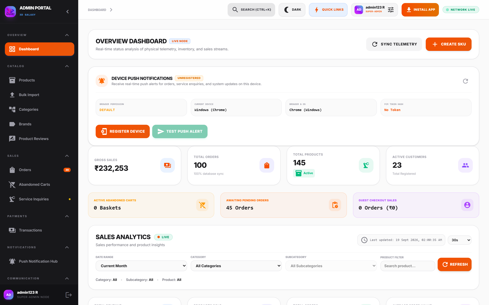
*Figure 2.1 — Administrative Navigation Sidebar Hierarchy showing functional operational grouping.*

---

## 3. EXECUTIVE DASHBOARD & OPERATIONS HUB

### 3.1 Page Details
* **Access Path**: Admin Portal → Dashboard (`/admin?tab=dashboard`)
* **Primary Role**: Store Administrator, Operations Manager, Executive Stakeholder


*Figure 3.1 — Executive Operations Dashboard featuring top-level KPI telemetry, order queues, and inventory alerts.*

### 3.2 Key Telemetry Widgets
1. **Total Revenue Card**: Aggregates gross customer payments processed through Razorpay, UPI, and verified manual orders. Includes trend percentage against previous 30-day period.
2. **Order Volume Card**: Real-time count of total orders received, segmented by fulfillment status (Pending, Shipped, Delivered).
3. **Active Customer Count**: Measures registered client profiles and repeat purchasing velocity.
4. **Active Product Inventory**: Counts published SKUs, variant sub-items, and flags low-stock warnings (< 5 units).
5. **Revenue Velocity Graph**: Area chart illustrating 7-day, 30-day, and quarterly revenue trajectories.
6. **Recent Order Activity Log**: Immediate access to the latest client transactions with customer contact, amount, and fulfillment status tags.

---

## 4. CATALOG MANAGEMENT & MASTER INVENTORY

### 4.1 Page Details
* **Access Path**: Admin Portal → Products (`/admin?tab=products`)
* **Primary Role**: Catalog Manager, Inventory Controller

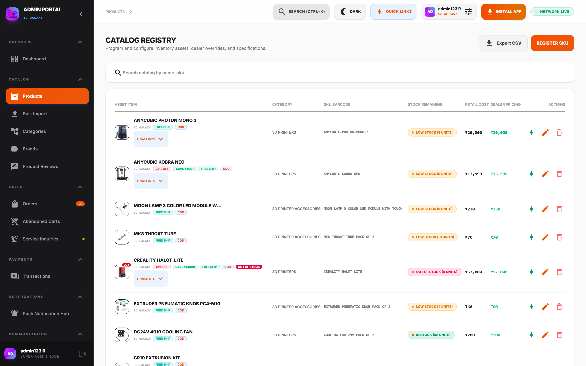
*Figure 4.1 — Master Product Catalog Console displaying SKU identifiers, real-time stock levels, pricing tiers, and active status toggles.*

### 4.2 Product List Overview
The catalog table provides instant visibility across all items:
* **Thumbnail & Title**: High-resolution image badge and canonical product name.
* **SKU & Barcode**: Alphanumeric warehouse bin identifier and barcode.
* **Category Tagging**: Hierarchical taxonomy badge (e.g., FDM 3D Printers, Filaments).
* **Inventory Stock**: Physical warehouse counter with dynamic color-coding (Green > 10, Amber 1–9, Red 0).
* **Pricing Columns**: MRP (crossed out), Sale Price (checkout cost), and Dealer Price (B2B wholesale).
* **Storefront Toggle**: Instant switch between Published and Draft modes.

---

## 5. COMPREHENSIVE PRODUCT CONFIGURATION

The Product Editor is organized into **11 specialized functional tabs**. Every tab governs a specific dimension of customer experience, logistics, and data integrity.

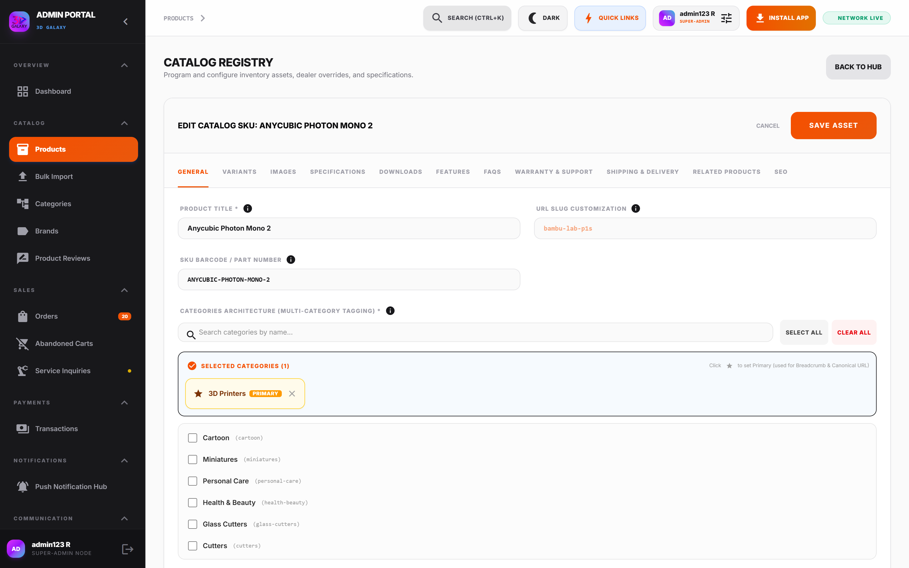
*Figure 5.1 — Product Configuration Interface displaying the 11 functional tabs.*

---

### Tab 1: General Product Details
* **Purpose**: Defines master catalog identity, base pricing, warehouse stock, and core taxonomy.
* **Available Fields**:
  * `Product Title`: Canonical customer-facing title.
  * `URL Slug`: Auto-generated, URL-safe identifier for SEO.
  * `SKU / Barcode`: Unique inventory code.
  * `Primary Category`: Assigned category and parent taxonomy.
  * `Brand / Manufacturer`: Brand attribution (e.g., Creality, Bambu Lab, 3D Galaxy).
  * `MRP (₹)`: Base retail anchor price.
  * `Retail Sale Price (₹)`: Active checkout price.
  * `Authorized Dealer Price (₹)`: B2B wholesale rate.
  * `Physical Stock Inventory`: Warehouse inventory counter when no variants exist.
  * `Status Policy`: Active Storefront, Draft (Admin Only), or Out of Stock.
  * `COD Availability`: Toggle permitting Cash on Delivery.
  * `Short Highlight Specs`: Bullet summary rendered adjacent to product image.
  * `Long Description`: Comprehensive technical breakdown with rich text formatting.
  * `Featured Product`: Homepage featured spotlight toggle.
  * `Included Bundle Products`: Add complimentary products provided for free with this item.


*Figure 5.2 — General Configuration Subsection with pricing, stock counters, and taxonomy selectors.*

#### Cross-Module Impact of Value Changes
* **Sale Price Changed**:
  $$\text{Admin Input} \longrightarrow \text{Storefront Card} \longrightarrow \text{Cart Line Total} \longrightarrow \text{Razorpay Order} \longrightarrow \text{GST Invoice}$$
* **Stock Changed**:
  $$\text{Admin Input} \longrightarrow \text{Badge (In Stock / Sold Out)} \longrightarrow \text{Cart Max Quantity Restriction} \longrightarrow \text{Order Placement Decrement}$$
* **Category Changed**:
  $$\text{Admin Input} \longrightarrow \text{Mega-Menu Navigation} \longrightarrow \text{Breadcrumb Links} \longrightarrow \text{Category Shipping Override Engine}$$

---

### Tab 2: Variants
* **Purpose**: Orchestrates multi-tiered variant groups, attribute options, display selectors, and selection modes.
* **Available Fields**: Variant group builder, display type dropdown, selection mode toggle, required flag, values array, and bundle tiers editor.
* *(See Section 6 for the complete, deep-dive variant configuration guide).*

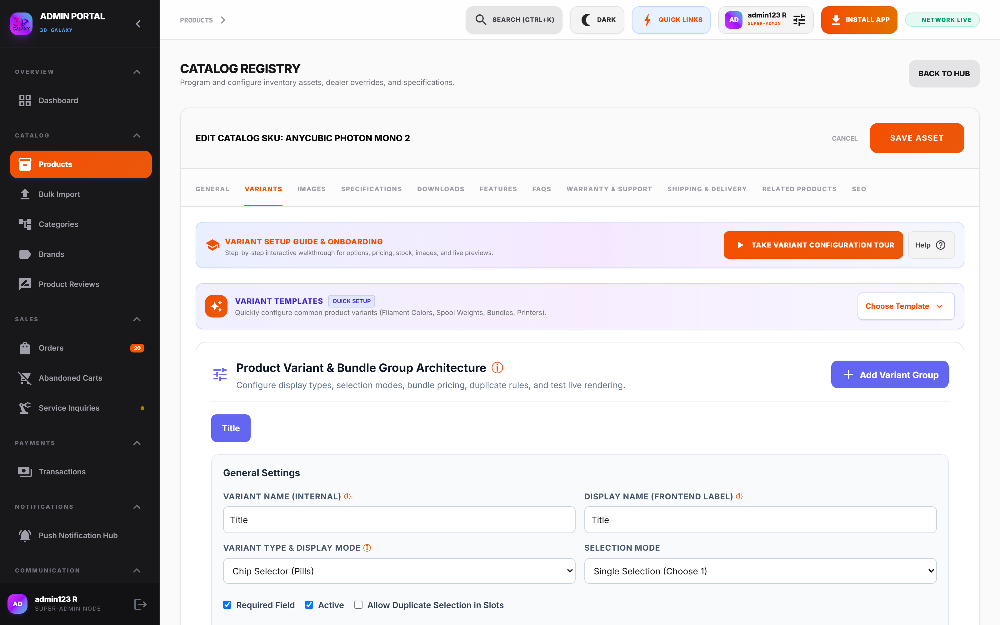
*Figure 5.3 — Product Variants Builder configuring groups, display modes, and value options.*

---

### Tab 3: Images & Variant Mapping
* **Purpose**: Manages primary hero photography, multi-angle secondary galleries, and variant-to-image binding.
* **Available Fields**: Drag-and-drop uploader, primary thumbnail selector, image reordering handles, and **Linked Variant Dropdown** per image.
* **Admin Procedure**:
  1. Upload all product photography (minimum 1000×1000px, WebP/PNG).
  2. Mark the primary hero image.
  3. For color-specific images, open the *Linked Variant* dropdown and select the corresponding variant value (e.g., "Signal Red").
  4. Save product.

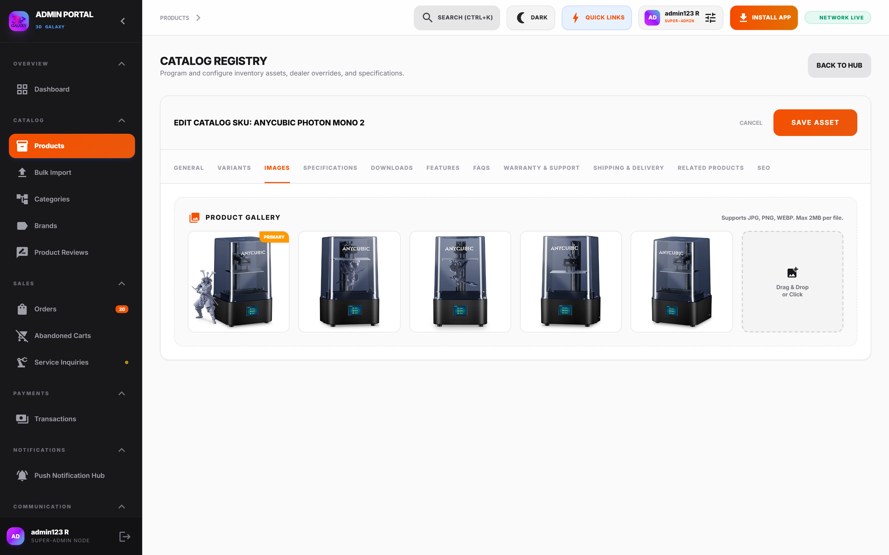
*Figure 5.4 — Variant Image Mapping Interface linking image assets to exact variant values.*

#### Customer Experience Impact
* **When Image Has Linked Variant**:
  $$\text{Customer clicks Red Thumbnail} \longrightarrow \text{Gallery displays Red} \longrightarrow \text{Color Selector automatically highlights Red} \longrightarrow \text{Price updates to Red Variant}$$
* **When Image Has No Linked Variant**:
  $$\text{Customer clicks Secondary Angle} \longrightarrow \text{Gallery switches view} \longrightarrow \text{Selected variant remains unchanged}$$

---

### Tab 4: Specifications
* **Purpose**: Provides structured technical parameters rendered in the storefront specifications table.
* **Available Fields**: Dynamic key-value pairs (`Specification Name`, `Specification Value`).
* **Standard 3D Printing Attributes**:
  * *Printing Technology* (e.g., FDM / SLA / SLS)
  * *Build Volume* (e.g., $256 \times 256 \times 256\text{ mm}$)
  * *Max Nozzle Temperature* (e.g., $300^\circ\text{C}$)
  * *Heated Bed Temperature* (e.g., $100^\circ\text{C}$)
  * *Layer Resolution* (e.g., $0.08 - 0.28\text{ mm}$)
  * *Nozzle Diameter* (e.g., $0.4\text{ mm}$ Hardened Steel)
  * *Supported Filaments* (e.g., PLA, PETG, TPU, ABS, Carbon Fiber)
* **Best Practice**: Use uniform nomenclature across all products in the same category to allow reliable comparison.

---

### Tab 5: Downloads & Documentation
* **Purpose**: Distributes software slicing profiles, firmware updates, user manuals, and calibration test files directly to customers.
* **Available Fields**: Download Title, File URL / Upload, Version Tag, File Type (`.pdf`, `.curaprofile`, `.3mf`, `.bin`), and File Size.
* **Customer Impact**: Rendered in a dedicated *Downloads* tab on the product page, reducing customer support inquiries regarding setup and slicer calibration.

---

### Tab 6: Features & Value Propositions
* **Purpose**: Creates visual feature cards highlighting unique engineering benefits.
* **Available Fields**: Feature Card Icon (Material icon name), Feature Title, Short Descriptive Blurb, and Optional Accent Graphic.
* **Storefront Presentation**: Displayed as responsive 2-column or 3-column feature grids directly beneath the primary buy box.

---

### Tab 7: Frequently Asked Questions (FAQs)
* **Purpose**: Product-specific accordion Q&A addressing common pre-purchase questions.
* **Available Fields**: Question text, Answer text (rich text), Sort Order, and Active toggle.
* **Customer Impact**: Increases conversion rate by answering compatibility, power requirement, and spool size questions without leaving the page.

---

### Tab 8: Warranty & Support
* **Purpose**: Establishes transparent legal warranty terms, support channel availability, and return policies.
* **Available Fields**:
  * `Warranty Duration`: e.g., 12 Months Official Manufacturer Warranty.
  * `Support Channels`: Email Support, WhatsApp Direct Hotline, Video Assistance.
  * `Replacement Policy`: 7-Day Dead on Arrival (DOA) replacement window.
  * `Exclusions`: User-induced nozzle clogs, improper electrical supply, unauthorized firmware modifications.

---

### Tab 9: Shipping & Delivery Configuration
* **Purpose**: Governs item-specific shipping tariffs, free shipping exemptions, parcel weights, and delivery buffers.
* **Available Fields**:
  * `Custom Shipping Fee (₹)`: Overrides global rate when set > 0.
  * `Free Shipping Toggle`: Grants zero shipping charge regardless of cart value.
  * `Calibrated Weight (grams)`: Drives courier weight-bracket calculations.
  * `Delivery Estimate Days`: Buffer added to current date (e.g., 3–5 Days).

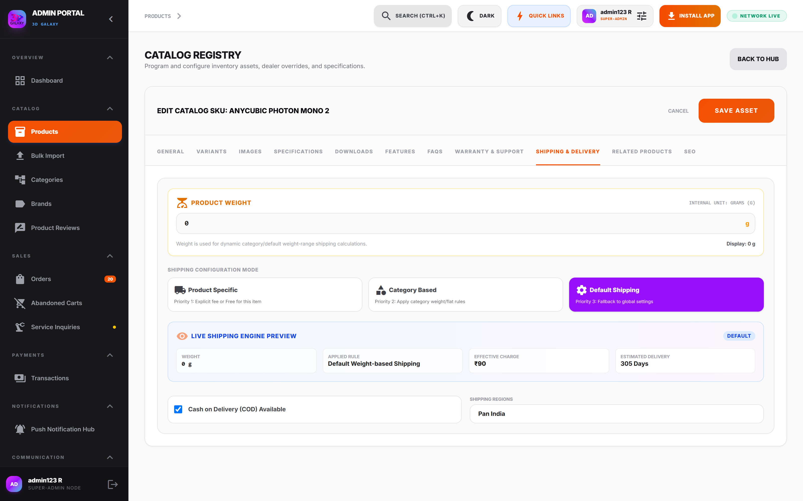
*Figure 5.5 — Shipping & Delivery Configuration showing calibrated weight, custom tariffs, and delivery day buffers.*

---

### Tab 10: Related Products & Cross-Sell
* **Purpose**: Drives Average Order Value (AOV) by linking compatible accessories, replacement parts, and materials.
* **Available Fields**: Multi-select product picker from live catalog.
* **Storefront Rendering**: Rendered as a *"Frequently Bought Together"* or *"Compatible Consumables"* carousel on the product detail page.

---

### Tab 11: Search Engine Optimization (SEO)
* **Purpose**: Maximizes organic search visibility across Google, Bing, and social sharing platforms.
* **Available Fields**:
  * `Meta Title`: Browser title tag (optimal 50–60 characters).
  * `Meta Description`: Search snippet summary (optimal 150–160 characters).
  * `Meta Keywords`: Comma-separated search indexing tags.
  * `Canonical URL`: Canonical indexing override to prevent duplicate content flags.
  * `OpenGraph Image`: Social media card preview image when link is shared on WhatsApp, Facebook, or LinkedIn.

---

## 6. PRODUCT VARIANT CONFIGURATION GUIDE

### 6.1 Architecture Overview
The 3D Galaxy Variant Engine is engineered around a flexible group hierarchy:

```
PRODUCT MASTER
      │
      ├── Variant Group 1: Material (Display: Chip | Mode: Single)
      │     ├── PLA
      │     ├── PETG
      │     └── ABS
      │
      ├── Variant Group 2: Spool Weight (Display: Weight Selector | Mode: Weight)
      │     ├── 250g Sample (Weight: 250g | Tariff: ₹350)
      │     ├── 1.0kg Standard (Weight: 1000g | Tariff: ₹899)
      │     └── 5.0kg Bulk (Weight: 5000g | Tariff: ₹3,999)
      │
      └── Variant Group 3: Color (Display: Color Chips | Mode: Single)
            ├── Galaxy Black (#000000)
            ├── Signal Red (#FF2200)
            └── Electric Blue (#0066FF)
```

#### Variant Group Configuration Fields
* **Variant Name (Internal)**: Lowercase alphanumeric identifier used by database and APIs (e.g., `spool_weight`, `filament_color`).
* **Display Name**: Customer-facing label rendered on storefront (e.g., *"Select Spool Weight"*, *"Choose Color"*).
* **Variant Type & Display Mode (`displayType`)**: Controls the UI component used to present options to the buyer.
* **Selection Mode (`selectionMode`)**: Defines mathematical constraints and rules for option selection.
* **Required Field (`required`)**: When enabled, the customer cannot add the item to cart without selecting an option.
* **Active (`active`)**: Global toggle enabling or disabling the entire variant group.
* **Allow Duplicate Selection in Slots (`allowDuplicates`)**: Used in Bundle Builders to permit selecting the same color multiple times (e.g., 3× Black in a 3-pack bundle).

---

### 6.2 The 11 Variant Display Types

| Display Type | Technical Key | Purpose & Description | Recommended Use Cases | Customer Experience | Admin Configuration |
| :--- | :--- | :--- | :--- | :--- | :--- |
| **Bundle Builder** | `bundle-builder` | Presents tiered package cards with interactive slot-filling selectors. | Buy 1 / Buy 3 / Buy 5 multi-packs, starter kits. | Radio cards displaying savings badges with color slot pickers below. | Add bundle tiers, define count, price type, and allow duplicates. |
| **Weight Selector** | `weight-selector` | Presets weight buttons calibrated directly with shipping calculations. | Filament spools (250g, 500g, 1kg, 2kg, 5kg), resin bottles. | Horizontal pill buttons showing weight and live parcel weight tally. | Specify weight in grams/kilograms and assign weight units. |
| **Chip Selector** | `chip` | Compact rounded pill buttons for concise text options. | Sizes (S, M, L), nozzle diameters (0.2mm, 0.4mm, 0.6mm). | Rounded rectangular buttons with active blue borders. | Enter comma-separated values; reorder chips via drag handles. |
| **Dropdown Menu** | `dropdown` | Standard select box for extensive option lists (> 10 items). | Replacement component lists, complex hardware part numbers. | Clean collapsible dropdown with scrollable options. | Define option values list; set default selected placeholder. |
| **Image Selector** | `image` | Visual thumbnail swatches showing sub-model textures or finishes. | Machine colorways, textured build plate surfaces. | Grid of square image thumbnails with selected checkmark. | Upload thumbnail per option and bind image asset. |
| **Card Selector** | `card` | Rich descriptive cards containing subheadings, pricing, and icons. | Printer machine packages (Base, Combo AMS, Complete Kit). | Vertical or horizontal cards with title, bullet features, and price. | Enter title, feature blurb, and relative price offset. |
| **Radio Chips** | `radio-chips` | Pill chips with embedded radio selection rings. | Warranty extensions (1 Year, 2 Years, 3 Years). | Chip button containing circular radio button inside. | Provide option strings and mark initial radio selection. |
| **Color Chips** | `color-chips` | Visual circular color swatches showing exact hex codes. | Filament colors, resin hues, anodized metal finishes. | Circular color circles with tooltips and checkmark on active choice. | Enter Color Name and exact Hex code (e.g., `#FF2200`). |
| **Button Group** | `button-group` | Segmented horizontal button bar with unified container. | Voltage options (110V / 220V), enclosure options (Open / Closed). | Continuous segmented button bar with active slide state. | Add discrete button values. |
| **Quantity Selector**| `quantity-selector`| Stepper interface (+ / -) for volume bracket discounts. | Nozzle packs, fastener kits, purge wipers. | Stepper counter showing incremental discount brackets. | Configure quantity steps and minimum/maximum constraints. |
| **Grid Cards** | `grid-cards` | 2-column or 3-column responsive card matrix for machine models. | 3D Printer product family (A1 Mini, A1, P1S, X1-Carbon). | High-impact card grid with specs and price comparison. | Configure model names, specs summary, and card layout. |

---

### 6.3 The 6 Selection Modes

#### 1. Single Selection (`single`)
* **Definition**: The customer must select exactly one option from the group.
* **When to Use**: Mutually exclusive choices (e.g., Nozzle Diameter, Voltage, Base Color).
* **Pricing & Stock Impact**: Overrides base price and checks stock of the selected variant combination.

#### 2. Bundle Selection (`bundle`)
* **Definition**: Customer selects a package tier (e.g., 3-Pack), unlocking interactive slots to customize the contents.
* **When to Use**: Multi-item spool bundles, starter packs.
* **Pricing & Stock Impact**: Applies fixed bundle price or per-item bundle price. Validates inventory for each selected item slot.

#### 3. Weight-Based (`weight`)
* **Definition**: Binds the selected variant directly to product mass and shipping tariffs.
* **When to Use**: Consumables sold by mass (250g, 1kg, 5kg).
* **Pricing & Stock Impact**: Recalculates shipping fee at checkout based on total weight:
  $$\text{Shipment Weight} = \text{Variant Weight} \times \text{Quantity}$$

#### 4. Multiple Selection (`multiple`)
* **Definition**: Customer can check multiple add-on options simultaneously.
* **When to Use**: Optional add-ons (e.g., Extra Textured PEI Sheet + 0.6mm Hardened Nozzle + 1kg PLA).
* **Pricing & Stock Impact**: Cumulatively adds each selected add-on price to the line item total.

#### 5. Quantity-Based Variant (`quantity`)
* **Definition**: Variant choice dictates pack quantity with volume-tiered pricing.
* **When to Use**: Fasteners, silicone socks, cleaning needles (Pack of 5, Pack of 10, Pack of 25).
* **Pricing & Stock Impact**: Decrements pack quantity count from inventory.

#### 6. Package / Starter Kit Builder (`pack`)
* **Definition**: Guided multi-step builder allowing customers to configure a complete custom machine setup.
* **When to Use**: Education bundles (Printer + 5 Spools + Tool Kit + Training Course).
* **Pricing & Stock Impact**: Decrements inventory across multiple distinct SKUs simultaneously upon checkout.

---

### 6.4 Variant Pricing Models & Architecture

```
                               BASE RETAIL PRICE (₹)
                                        │
             ┌──────────────────────────┴──────────────────────────┐
             ▼                                                     ▼
     PER-VARIANT PRICING                                  FIXED BUNDLE PRICING
     (Each option has an offset                          (Entire bundle is sold
      or specific price override)                         for a single set price)
             │                                                     │
    Example: 1kg = ₹899                                  Example: Buy 3 Pack = ₹2,199
             2kg = ₹1,699                                        (Flat ₹2,199 total)
             5kg = ₹3,999
             │                                                     │
             └──────────────────────────┬──────────────────────────┘
                                        ▼
                             STOREFRONT PRODUCT PAGE
                                        │
                                        ▼
                                  SHOPPING CART
                                        │
                                        ▼
                                CHECKOUT & PAYMENT
```

* **Base Price**: Anchor price set in the General tab.
* **Variant Price Override**: Explicit price assigned to an individual variant combination in the Combination Matrix.
* **Bundle Tier Price Types**:
  * `fixed`: Set total package price (e.g., Buy 5 for ₹3,024 flat).
  * `per_variant`: Individual item cost within bundle (e.g., ₹642 per spool when buying 3).
  * `percentage`: Automatic discount percentage off base price (e.g., 15% off).

---

### 6.5 Variant Weight & Shipping Calculation Formula

Variant weight directly impacts courier logistics and packing box sizing.

$$\text{Total Package Weight} = \sum_{i=1}^{n} (\text{Variant Weight}_i \times \text{Quantity}_i) + \text{Packaging Tare Weight}$$

#### Practical Calculation Example:
* Customer orders **$4 \times 250\text{g}$ Spools**:
  $$250\text{g} \times 4 = 1000\text{g} = 1.0\text{kg}$$
* The courier shipping engine places this shipment into the **$1.0\text{kg}$ Tariff Bracket**, avoiding undercharged shipping fees.

---

### 6.6 The Default Variant Flag
Every product with variants must have an intentional **Default Variant**:
* Marked with the **Star Icon** in the Combination Matrix.
* Governs the initial price, hero image, stock badge, and weight displayed when a customer first lands on the product page.
* **Caution**: If the default variant is out of stock, the storefront will display *"Sold Out"* on first load, even if other variants have inventory. Always ensure the default variant has active physical stock.

---

### 6.7 Combination Matrix Generation
When a product has two or more variant groups (e.g., Material × Color), clicking **Generate Combination Matrix** builds a Cartesian permutation table.

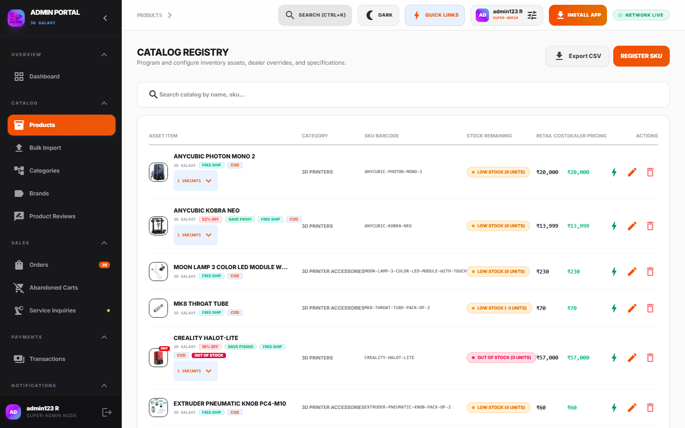
*Figure 6.1 — Combination Matrix Table with SKU generation, price overrides, stock allocation, and calibrated weights.*

#### Matrix Table Columns
1. **Variant Combination**: Auto-generated label (e.g., *"PLA - Signal Red - 1kg"*).
2. **SKU Code**: Unique inventory identifier (e.g., `PLA-RED-1KG`).
3. **MRP (₹)**: Base anchor price for this specific permutation.
4. **Sale Price (₹)**: Active checkout price.
5. **Stock Allocation**: Independent warehouse inventory counter.
6. **Weight (grams)**: Exact calibrated parcel weight.
7. **Status**: Active / Disabled toggle.
8. **Default**: Radio button setting this combination as the primary storefront view.

---

### 6.8 Live Storefront Variant Switcher Preview
Before publishing product changes, administrators should test the configuration using the **Live Customer Variant Switcher Preview** built into the editor.


*Figure 6.2 — Live Storefront Customer Preview embedded in admin portal for pre-flight validation.*

#### Administrator Pre-Flight Validation Steps
- [ ] Select each variant option and verify the price updates accurately.
- [ ] Confirm the main gallery image switches to the correct colorway.
- [ ] Verify out-of-stock badges appear when selecting zero-inventory variants.
- [ ] Confirm the calculated delivery date renders with the proper buffer days.

---

## 7. DYNAMIC VARIANT TEMPLATES & SAFETY RULES

### 7.1 Verified Pre-Configured Templates
To accelerate catalog expansion, 3D Galaxy includes **10 pre-engineered variant templates**:

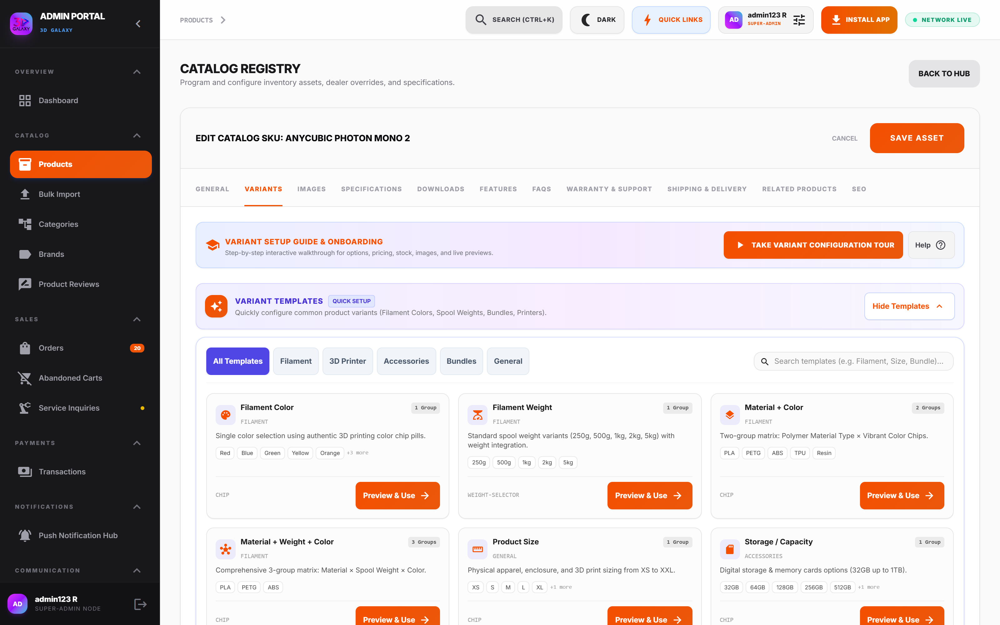
*Figure 7.1 — Dynamic Variant Templates Library showing pre-built schemas and collision protection.*

| Template Name | Technical ID | Category | Configured Groups & Values |
| :--- | :--- | :--- | :--- |
| **Filament Color** | `filament-color` | Filament | 1 Group: Color (Chip selector with 8 standard colors: Red, Blue, Green, Yellow, Orange, Black, White, Grey). |
| **Filament Weight** | `filament-weight` | Filament | 1 Group: Spool Weight (Weight selector with 250g Sample, 500g, 1kg Standard, 2kg Value, 5kg Bulk). |
| **Material + Color** | `material-color` | Filament | 2 Groups: Material (PLA, PETG, ABS, TPU, Resin) × Color (Color Chips). |
| **Material + Weight + Color** | `material-weight-color` | Filament | 3 Groups: Material (PLA, PETG, ABS) × Spool Weight (500g, 1kg) × Color (Black, White, Grey, Red, Blue). |
| **Product Size** | `product-size` | General | 1 Group: Size (XS, S, M, L, XL, XXL). |
| **Storage / Capacity** | `storage-capacity` | Accessories | 1 Group: Storage Capacity (32GB, 64GB, 128GB, 256GB, 512GB, 1TB). |
| **Size + Color** | `size-color` | Accessories | 2 Groups: Size (S, M, L, XL) × Color (Color Chips: Red, Blue, Black, White). |
| **Bundle Pack** | `bundle-pack` | Bundles | 1 Group: Bundle Pack (Buy 1 @ ₹756, Buy 3 @ ₹642 each, Buy 5 @ ₹3,024 flat). |
| **3D Printer Configuration** | `printer-configuration`| 3D Printer | 2 Groups: Printer Model (Card Selector: A1, A1 Mini, P1S, K1) × Package Configuration (Printer Only, Combo with AMS). |
| **Custom Variant** | `custom-variant` | General | Blank starting template ready for manual field customization. |

---

### 7.2 Variant Template Operational Safety Rules
To safeguard active store inventory, the template engine enforces strict safety constraints:

1. **No Silent Overwrites**: Applying a template defaults to `APPEND` mode. Existing variant groups are never wiped without explicit administrative confirmation.
2. **Duplicate Detection & Collision Warning**: If a template contains a group name already present on the product (e.g., `color`), the system highlights the collision and warns the admin.
3. **Template Changes Are Local**: Updating or applying a template modifies only the current product draft; it does not alter previously saved products.
4. **Independent Stock Allocation**: Templates supply option structure and prices, but physical stock must always be entered manually based on actual warehouse count.
5. **Explicit Image Linking**: Applying a template does not automatically link images; the administrator must explicitly map photos under the *Images* tab.
6. **Intentional Default Selection**: After generating combinations from a template, always verify that the default variant star is placed on an in-stock combination.

---

## 8. ORDERS & LOGISTICS CONSOLE

### 8.1 Complete Order Lifecycle

```
PENDING PAYMENT  ──►  PROCESSING  ──►  COURIER DISPATCHED  ──►  OUT FOR DELIVERY  ──►  DELIVERED
       │                                                                                   ▲
       └──────────────────────────► CANCELLED / REFUNDED ──────────────────────────────────┘
```

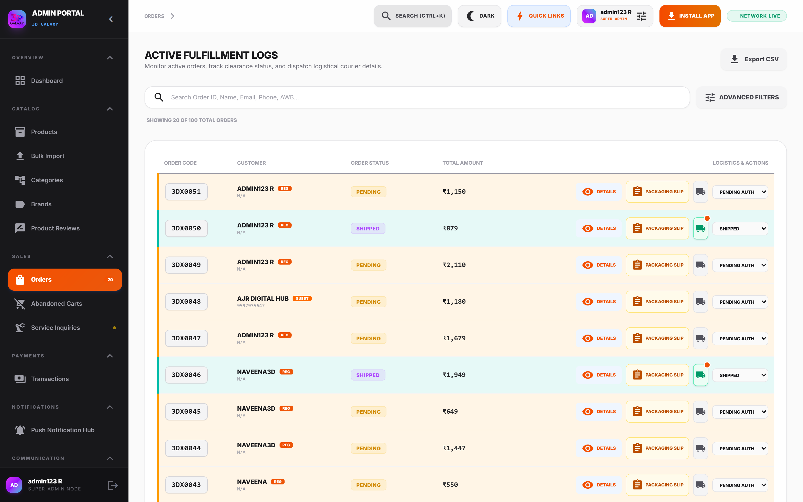
*Figure 8.1 — Master Orders Management Console with order identifiers, payment verification tags, and fulfillment dropdowns.*

### 8.2 Order Inspection Modal
Clicking any order row opens the comprehensive **Sales Ledger Inspection Modal**:

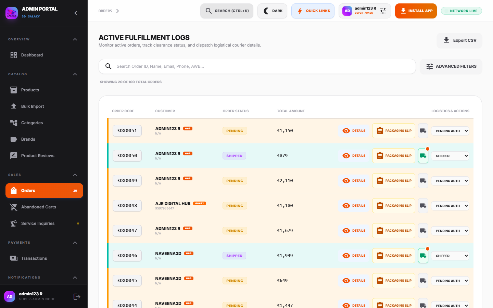
*Figure 8.2 — Order Sales Ledger Inspection Modal displaying customer address, itemized SKUs, GST breakdown, and dispatch actions.*

* **Customer Persona**: Full Name, Verified Email, Phone Number, and Shipping Address.
* **GST B2B Tax Verification**: Verified 15-digit GSTIN and Registered Legal Business Name for corporate tax credit invoices.
* **Itemized Ledger**: Booked SKUs, selected variant options, item weight, line prices, applied coupons, and shipping fees.
* **Fulfillment Action Controls**: Advance status (`pending` $\rightarrow$ `processing` $\rightarrow$ `shipped` $\rightarrow$ `completed`), enter courier partner, and input tracking URL.

---

## 9. CUSTOMIZED 3D MODEL (STL) SLICING & QUOTES

### 9.1 Background & Workflow
Clients upload 3D models (`.stl`, `.obj`) directly for custom additive manufacturing. The portal captures geometry parameters in the **STL Slicer Quotes** tab.

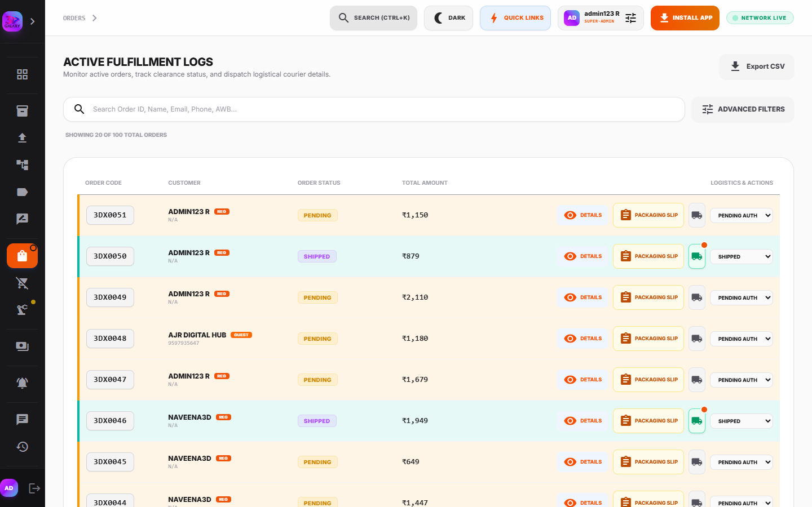
*Figure 9.1 — Customized STL Slicing & Quote Console displaying 3D model geometry, slicing specifications, and manual cost override.*

### 9.2 Captured Slicing Specifications
* **File Metadata**: Filename (e.g., `Gearbox_Housing_V3.stl`) and file size.
* **Volume & Mass**: Computed volume in cubic centimeters ($\text{cm}^3$) and mass in grams ($g$).
* **Material & Color**: Selected polymer (PLA, Tough PETG, Carbon Fiber Nylon, Castable Resin) and colorway.
* **Layer Resolution**: Vertical layer height ($0.12\text{ mm}$ Fine, $0.20\text{ mm}$ Standard, $0.28\text{ mm}$ Draft).
* **Infill Density**: Internal structural infill percentage (e.g., 20% Gyroid, 50% Grid, 100% Solid).
* **Client Remarks**: Custom engineering notes (e.g., *"Tap M3 threads post-cure"*).

### 9.3 Administrative Quoting Procedure
1. Inspect 3D geometry parameters and estimated print time.
2. Enter the final price in **Modify Manual Cost Override (INR)**.
3. Click **Dispatch Official Quote** to send a WhatsApp and email notification with an instant checkout payment link.
4. Upon client payment confirmation, click **Initiate Lab Cluster Fab** to route the slicing file to the 3D printer farm.

---

## 10. PACKING SLIPS & OFFLINE SALES DOCKETS

### 10.1 Packing Slip Generation
Before handing parcels to couriers, warehouse personnel generate official packing slips from the order detail view:

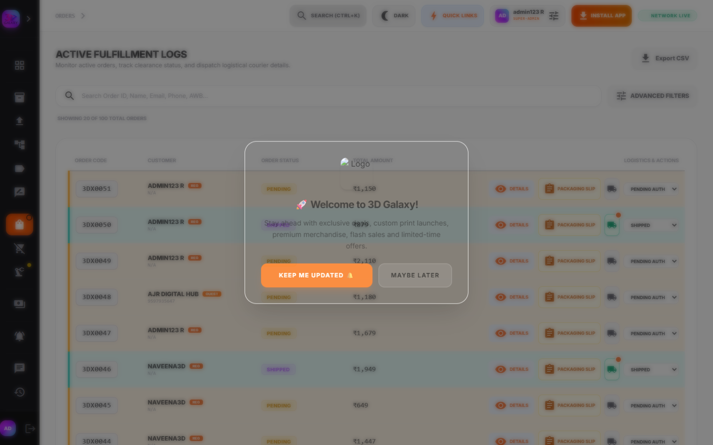
*Figure 10.1 — Printable Packing Slip formatted for thermal label printers and warehouse dispatch audits.*

* Displays barcode, order code, client shipping address, itemized SKU checklist, and parcel gross weight.
* Includes warehouse bin location for rapid order picking.

### 10.2 Offline Direct Booking (Draft Orders)
For walk-in showroom visitors or phone inquiries:
1. Navigate to **Orders → Offline Booking**.
2. Input customer details (Name, Phone, Email, Delivery Address).
3. Search catalog and add SKUs with custom quantities.
4. Apply authorized commercial discounts.
5. Click **Generate Manual Order**. The system creates an official `GLX-XXXXXX` record and dispatches a secure payment link to the customer.

---

## 11. CUSTOMER DIRECTORY & CRM MANAGEMENT

### 11.1 Customer Directory
* **Access Path**: Admin Portal → Customers (`/admin?tab=customers`)

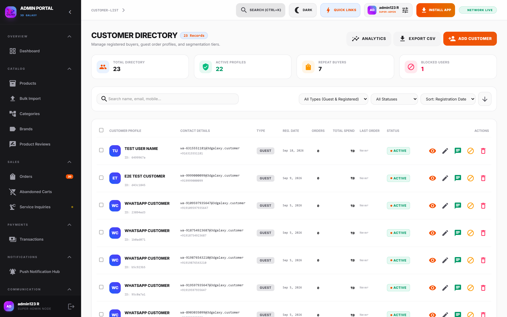
*Figure 11.1 — Customer Directory tracking client accounts, lifetime spend, order count, and account status.*

### 11.2 Customer Profile Inspection
Clicking any customer opens their complete CRM dossier:

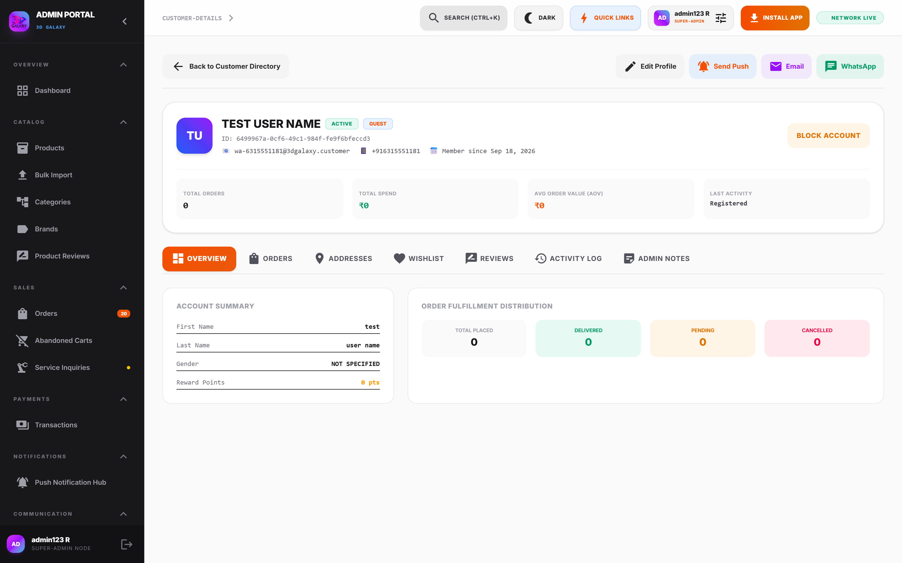
*Figure 11.2 — Customer Profile Dossier displaying complete order history, address book, and VIP tags.*

* **Lifetime Metrics**: Total Orders Placed, Cumulative Spend (₹), and Average Order Value (AOV).
* **Communication Log**: Record of all sent WhatsApp messages and push notifications.
* **Account Controls**: Mark customer as VIP Commercial Partner or Suspend Account if fraudulent activity is detected.

---

## 12. CUSTOMER ANALYTICS & RETENTION TELEMETRY

* **Access Path**: Admin Portal → Customers → Customer Analytics (`/admin?tab=customers`)

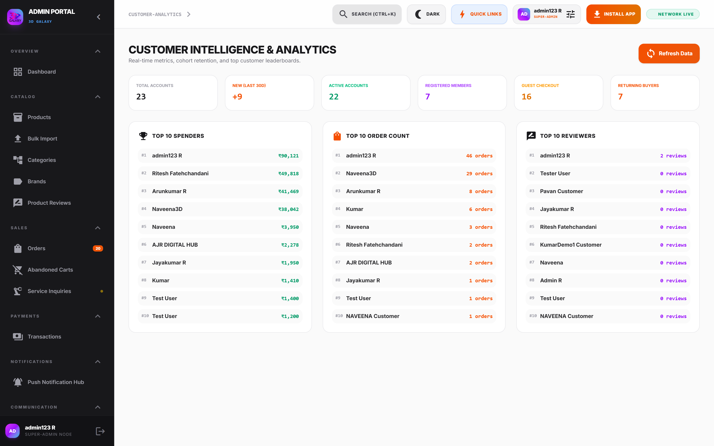
*Figure 12.1 — Customer Analytics Console showing Customer Lifetime Value (LTV), repeat purchase velocity, and cohort retention.*

### Core Analytical Telemetry
1. **Customer Lifetime Value (LTV)**: Average revenue generated per customer across their entire relationship with 3D Galaxy.
2. **Repeat Buyer Velocity**: Percentage of customers who complete two or more purchases within 90 days.
3. **New vs. Returning Cohort Ratio**: Measures acquisition efficiency against customer retention.
4. **Average Order Value (AOV)**: Evaluates the impact of bundle promotions on overall basket size.

---

## 13. STOREFRONT REVIEWS & REPUTATION MANAGEMENT

* **Access Path**: Admin Portal → Reviews (`/admin?tab=reviews`)

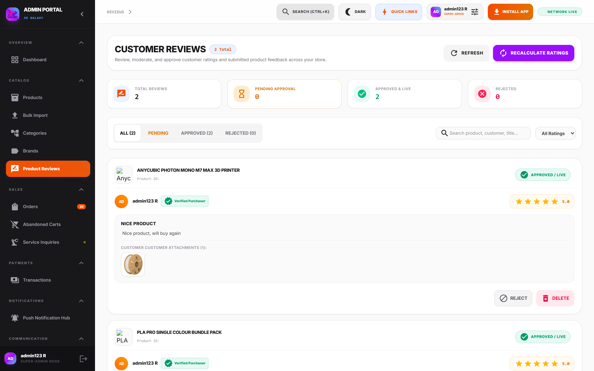
*Figure 13.1 — Customer Reviews Moderation Queue with star ratings, review text, and approval actions.*

### Moderation Workflow
* **Approve**: Publishes the review to the public product page and updates the product's average star rating.
* **Reject / Hide**: Suppresses spam, abusive language, or competitor reviews without deleting database history.
* **Delete**: Permanently removes malicious content from the system.

---

## 14. WHATSAPP BUSINESS INBOX & CONVERSATIONAL COMMERCE

### 14.1 Architecture & Live Inbox
The WhatsApp Inbox communicates directly with the **Meta WhatsApp Cloud API (Graph API v20.0)** via verified webhooks:

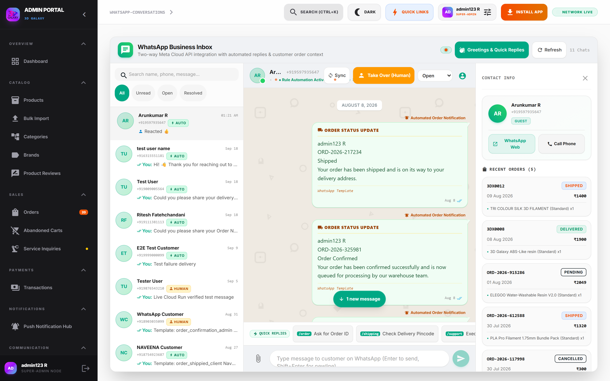
*Figure 14.1 — WhatsApp Business Cloud API Live Inbox featuring dual-pane conversation threads and customer CRM sidebar.*

* **Dual-Pane Interface**: Left pane displays active threads sorted by timestamp with unread message badges. Right pane renders full chat history.
* **Delivery Indicators**: Real-time message status ticks (Single Tick = Sent, Double Grey = Delivered, Double Blue = Read).
* **Customer Reaction Badges**: Displays customer emoji reactions (❤️, 👍, 🔥) attached to individual messages.
* **Context Sidebar**: Renders customer profile, recent order codes, delivery address, and payment status while chatting.


*Figure 14.2 — WhatsApp Conversation view with admin file attachment uploader and live status indicators.*

### 14.2 Dispatching Media Attachments
Administrators can send quotes, invoices, and technical guides directly to WhatsApp:
1. Click the paperclip icon in the message input bar.
2. Select an image (`.png`, `.jpg`) or document (`.pdf`).
3. Add an optional text caption.
4. Click **Send**. The media is uploaded to Meta's CDN and delivered securely to the customer's phone.

---

## 15. WHATSAPP RULE-BASED AUTOMATION ENGINE (ZERO-LLM)

### 15.1 Deterministic Architecture
To guarantee 100% reliable responses without AI hallucinations or per-token charges, the WhatsApp automation engine operates strictly on **deterministic rules**:

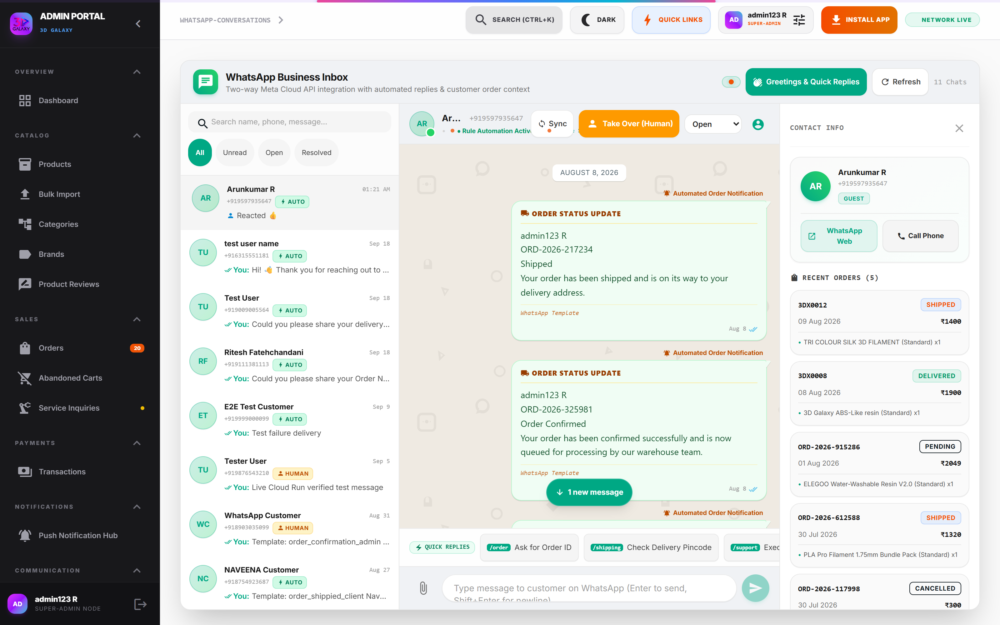
*Figure 15.1 — WhatsApp Automation Console configuring greeting sequences, keyword rules, and human takeover.*

### 15.2 Automation Rule Configurations
1. **Automated Welcome Sequence**: Instantly welcomes new customer inquiries and outlines support capabilities.
2. **Keyword Matching Rules**:
   * *Trigger: "CATALOG" or "PRICE"* $\longrightarrow$ Automatically replies with a direct link to the latest 3D printing catalog.
   * *Trigger: "STATUS" or "TRACK"* $\longrightarrow$ Prompts customer for order code and queries database for instant fulfillment status.
   * *Trigger: "STL" or "PRINT SERVICE"* $\longrightarrow$ Dispatches custom 3D printing submission guide and pricing table.
3. **Human Takeover Mode**: When an administrator types a response in a thread, automated keyword replies pause for **60 minutes** for that user to prevent robotic interference.

---

## 16. PUSH NOTIFICATION HUB & CAMPAIGN DESIGNER

### 16.1 Broadcast Campaign Builder
* **Access Path**: Admin Portal → Push Notifications (`/admin?tab=notifications`)

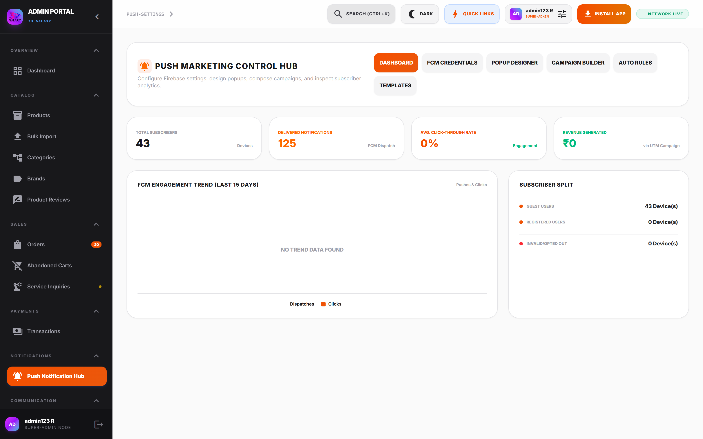
*Figure 16.1 — Push Notification Hub with broadcast statistics, active subscribers, and delivery metrics.*

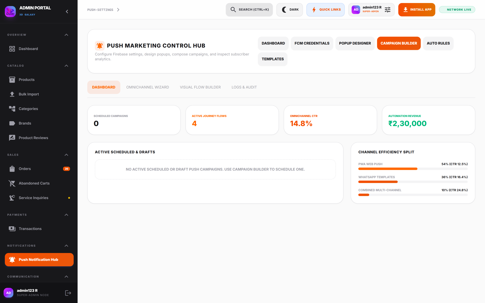
*Figure 16.2 — Push Notification Designer with audience targeting, banner image URLs, and deep-link routing.*

#### Campaign Parameters
* **Audience Segmentation**: Target *All Registered Users*, *Active Buyers (Last 30 Days)*, or *Lapsed Customers (> 60 Days)*.
* **Notification Title & Body**: High-converting promotional copy with emoji support.
* **Banner Image URL**: High-resolution promotional visual displayed in the Android/iOS notification tray.
* **Deep-Link URL**: In-app route taking the user directly to the promotional product (e.g., `/products/creality-k1-max`).

---

### 16.2 Notification Templates & Event Triggers
Standard automated system notifications triggered by lifecycle events:

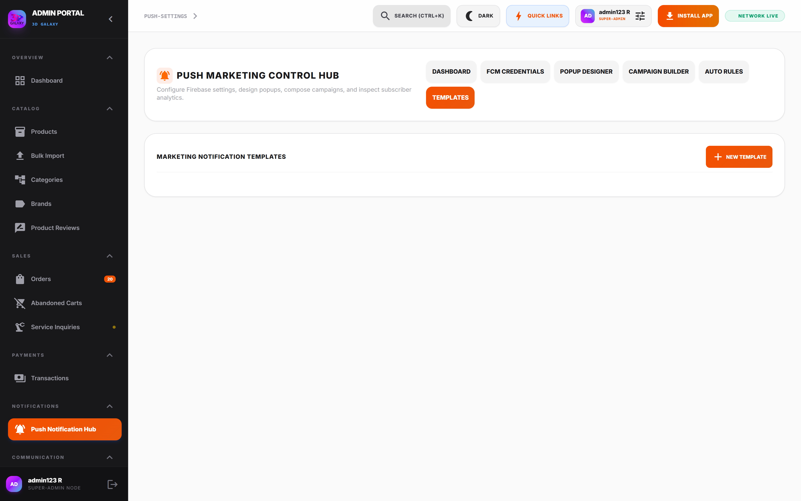
*Figure 16.3 — Notification Templates Console managing transactional notification templates.*

* **Order Confirmation**: Sent immediately upon payment verification.
* **Dispatch & Tracking**: Triggered when fulfillment advances to `shipped`, embedding courier tracking link.
* **Abandoned Cart Blast**: Dispatched 4 hours after a user abandons checkout, including a 5% discount code.
* **Back in Stock Alert**: Automatically alerts waitlisted users when inventory is replenished.

---

## 17. MARKETING RIBBONS, POPUPS & STOREFRONT PROMOTIONS

* **Access Path**: Admin Portal → Marketing (`/admin?tab=marketing`)

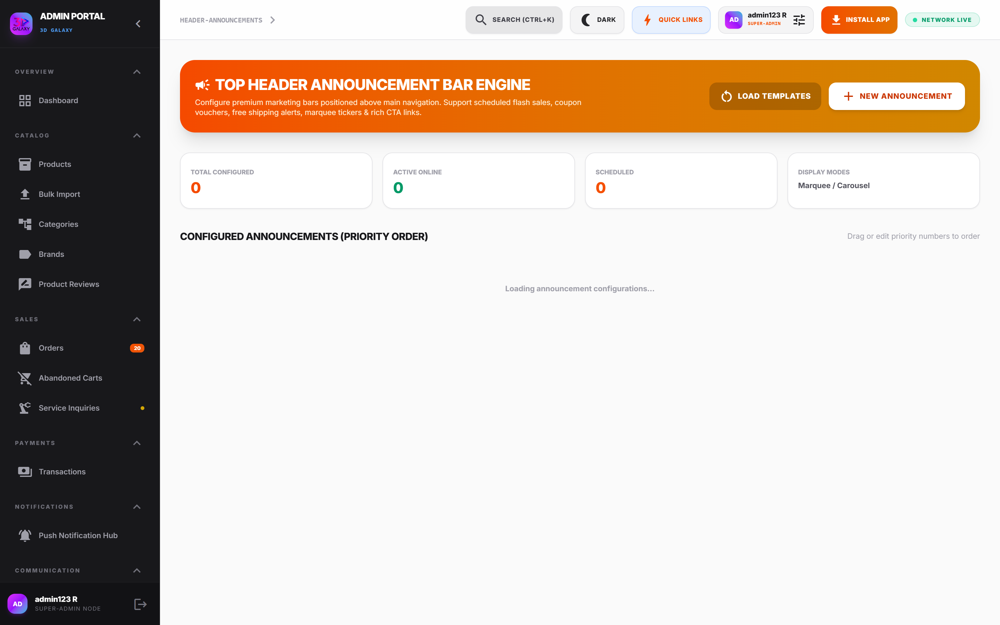
*Figure 17.1 — Marketing Management Console configuring announcement ribbons, promotional popups, and seasonal banners.*

### Marketing Features
* **Header Announcement Ribbon**: Store-wide header banner (e.g., *"Free shipping across India on orders above ₹1,999"*).
* **Timed Promotional Popups**: Conversion popups targeting first-time visitors with instant coupon vouchers.
* **Festival Sale Ribbons**: Countdown timer ribbons for festive events (Diwali Super Sale, Black Friday).

---

## 18. CATEGORY MANAGEMENT & STOREFRONT TAXONOMY

* **Access Path**: Admin Portal → Categories (`/admin?tab=categories`)

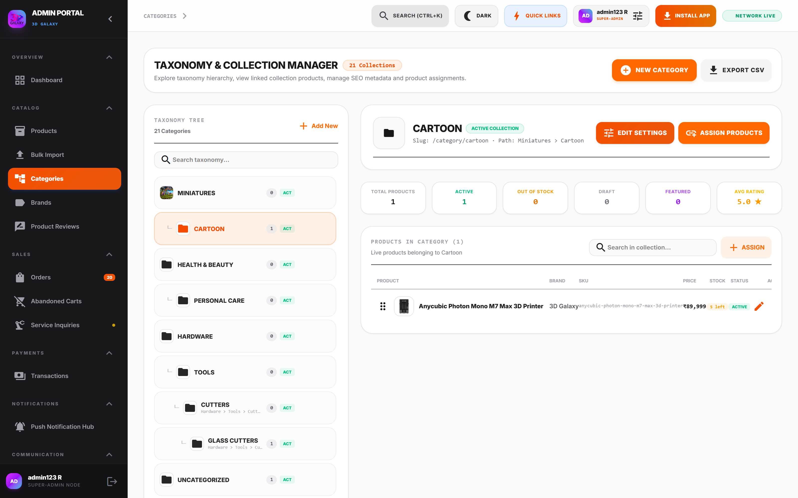
*Figure 18.1 — Category Management Console organizing category hierarchy, banner images, and SEO slugs.*

### Operational Hierarchy
* **Category Tree**: Multi-level taxonomy (Parent Categories $\rightarrow$ Subcategories).
* **Banner Assets**: High-resolution wide banners rendered atop category browse pages.
* **Display Order**: Integer sorting controlling sequence in storefront navigation menus.

---

## 19. SYSTEM CORE CONFIGURATOR (ALL 24 SETTINGS SUB-TABS)

The System Core Configurator (`/admin?tab=settings`) governs global store rules, API keys, third-party integrations, layout controls, and disaster recovery.

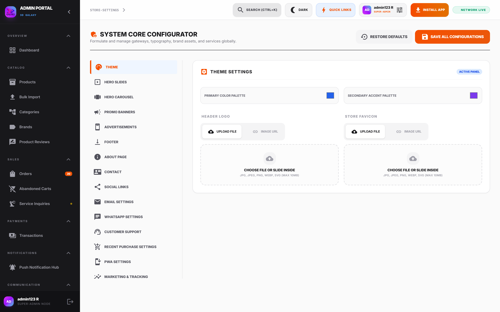
*Figure 19.1 — System Core Configurator showing the centralized 24-subtab navigation layout.*

---

### Sub-Tab 1: Theme Settings
* **Purpose**: Manages brand typography, color palettes, dark mode defaults, and visual layout geometry.
* **Configuration Options**:

| Setting | Description | Example | Operational Impact |
| :--- | :--- | :--- | :--- |
| `Store Title` | Global storefront title | 3D Galaxy India | Updates header and browser tab titles |
| `Tagline` | Brand positioning tagline | Precision 3D Printing Ecosystem | Rendered in footer and social share snippets |
| `Brand Primary Color`| Primary theme accent hex | `#0284C7` | Sets button colors, badges, and focus rings |
| `Brand Accent Color` | Secondary accent hex | `#EA580C` | Highlights promotional badges and CTA buttons |
| `Default Theme` | System theme on initial load | Dark Mode / Light Mode | Controls visitor initial visual presentation |

* **Admin Procedure**: Navigate to **Settings → Theme**, adjust color hex codes, preview layout, and click **Save All Configurations**.

---

### Sub-Tab 2: Hero Slides
* **Purpose**: Configures rotating visual hero banners displayed on the storefront homepage.
* **Configuration Options**:

| Setting | Description | Example | Operational Impact |
| :--- | :--- | :--- | :--- |
| `Title & Subtitle` | Headline promotional text | "Bambu Lab X1-Carbon" | Sets primary homepage visual message |
| `Image URL` | Desktop widescreen banner | `/images/hero_galaxy_ecosystem.png` | Main visual presentation asset |
| `Mobile Image URL` | Vertical aspect ratio image | `/images/hero_mobile.png` | Optimizes mobile loading speed and framing |
| `CTA Button Text` | Action button label | "Order Now" / "Explore Lab" | Directs visitor traffic to target catalog |
| `Link Destination` | Internal route or URL | `/products/bambu-x1-carbon` | Drives conversion funnel routing |
| `Slide Duration` | Display duration in ms | `4000` (4 seconds) | Controls carousel rotation pace |

---

### Sub-Tab 3: Hero Carousel
* **Purpose**: Governs animation physics, slide transitions, touch swipe sensitivity, and autoplay behavior.
* **Configuration Options**: Autoplay enable toggle, transition effect (`fade` vs `slide`), swipe gesture threshold, and pagination dot visibility.

---

### Sub-Tab 4: Promo Banners
* **Purpose**: Configures intermediate promotional banners between product sections on the homepage.
* **Configuration Options**: Banner Title, Discount Callout Badge (e.g., *"Save 25%"*), Banner Graphic URL, and Click Target Link.

---

### Sub-Tab 5: Advertisements
* **Purpose**: Manages commercial sponsored tiles and partner brand advertising spaces.
* **Configuration Options**: Partner Ad Identifier, Placement Zone (Sidebar, Product Page Footer), Banner Asset, and Referral Link.

---

### Sub-Tab 6: Footer Settings
* **Purpose**: Controls footer legal copy, company registration details, copyright lines, and quick link columns.
* **Configuration Options**: Copyright Text, Registered Business Address, GSTIN Disclosure, Customer Care Telephone, and Payment Icon Badges.

---

### Sub-Tab 7: About Page
* **Purpose**: Manages corporate mission statement, engineering facility history, lab capabilities, and executive team bios.
* **Configuration Options**: Mission Statement Headline, Facility Overview Paragraphs, Lab Equipment Photo URLs, and Quality Policy Statements.

---

### Sub-Tab 8: Contact Details
* **Purpose**: Configures official customer support contact points, warehouse location, and Google Maps embed.
* **Configuration Options**: Support Email Address, Central Hotline Phone, Warehouse Physical Address, Working Hours, and Google Maps Iframe Embed Code.

---

### Sub-Tab 9: Social Links
* **Purpose**: Manages outbound brand links to social media and developer communities.
* **Configuration Options**: URLs and active toggles for Instagram, YouTube, Facebook, LinkedIn, X/Twitter, Discord, and GitHub.

---

### Sub-Tab 10: Email Settings
* **Purpose**: Configures SMTP server parameters for transactional notifications.
* **Configuration Options**:

| Setting | Description | Example | Operational Impact |
| :--- | :--- | :--- | :--- |
| `SMTP Host` | Outgoing mail server host | `smtp.sendgrid.net` | Routes transactional order emails |
| `SMTP Port` | Connection port | `587` (TLS) / `465` (SSL) | Establishes secure handshake |
| `Sender Email` | Verified from email address | `orders@3dgalaxy.in` | Displays sender in customer inbox |
| `Sender Name` | Display name | `3D Galaxy Support` | Enhances brand email recognition |
| `API Key / Secret` | SMTP password / API token | `SG.••••••••••••` *(Masked)* | Authenticates outbound emails |

> [!NOTE]
> All credentials and API tokens are masked in the UI and documentation to protect production infrastructure.

---

### Sub-Tab 11: WhatsApp Settings
* **Purpose**: Configures Meta WhatsApp Cloud API credentials, webhook verification tokens, and message templates.
* **Configuration Options**:

| Setting | Description | Example | Operational Impact |
| :--- | :--- | :--- | :--- |
| `Phone Number ID` | Meta Graph API phone entity | `108492048593021` | Authenticates sending number |
| `WABA Account ID` | WhatsApp Business Account ID | `938472910485721` | Identifies Meta business account |
| `API Version` | Meta Graph API release | `v20.0` | Controls webhook payload format |
| `Webhook Token` | Verification challenge string | `3DG_WHATSAPP_TOKEN_2026` | Verifies inbound webhook authenticity |
| `API Access Token` | Permanent system user token | `EAAG••••••••••••` *(Masked)* | Grants sending permissions |

---

### Sub-Tab 12: Customer Support
* **Purpose**: Configures customer support channel routing, SLA response time indicators, and emergency support disclaimers.
* **Configuration Options**: Live Chat Enabled, WhatsApp Support Toggle, Expected Response Time (e.g., *"Within 2 Hours"*), and Support Hours.

---

### Sub-Tab 13: Recent Purchase Social Proof
* **Purpose**: Configures real-time or curated buyer notification toasts that appear in the bottom corner of the storefront to increase social proof.
* **Configuration Options**: Enable Social Proof Toasts, Display Interval (seconds), Toast Duration, and Target Product Pool.

---

### Sub-Tab 14: PWA Settings (Progressive Web App)
* **Purpose**: Governs Progressive Web App installation prompts, service worker caching policies, and offline accessibility for mobile administrators.
* **Configuration Options**: Enable PWA Module, Offline Cache Strategy, Install Banner Prompt Delay, and Service Worker Versioning.

---

### Sub-Tab 15: Marketing & Omnichannel Tracking
* **Purpose**: Centralized analytics and tracking suite supporting Meta Pixel, Conversions API (CAPI), Google Analytics 4, Google Ads, GTM, and Google Consent Mode v2.
* **Configuration Options**:

| Setting | Description | Example | Operational Impact |
| :--- | :--- | :--- | :--- |
| `Meta Pixel ID` | Browser-side tracking pixel | `948572019485720` | Tracks PageView, AddToCart, Purchase |
| `Meta CAPI Token` | Server-Side API Token | `EAAB••••••••••••` *(Masked)* | Bypasses ad-blockers for 100% conversion match |
| `GA4 Measurement ID`| Google Analytics 4 Stream ID| `G-9X72K4L9P2` | Tracks e-commerce funnel drop-off |
| `Google Ads Conv ID`| Google Ads Conversion Tag | `AW-847291048` | Tracks paid search return on ad spend |
| `GTM Container ID` | Google Tag Manager ID | `GTM-K492LP8` | Injects container script on all pages |
| `Consent Mode v2` | European/Global privacy mode| Enabled | Dynamically suppresses cookies prior to consent |

* **Admin Procedure**: Input IDs, click **Send Test CAPI Event** to verify server-to-server connectivity, and save settings.

---

### Sub-Tab 16: Admin Devices & Push Security
* **Purpose**: Monitors all devices with administrative session access, manages FCM push notification device tokens, and allows instant session revocation.
* **Configuration Options**: Active Device List, Device Type (Desktop, Mobile, Tablet), Browser & Operating System Telemetry, FCM Token Status, and **Revoke Access** action button.

---

### Sub-Tab 17: Shipping & Courier Settings
* **Purpose**: Defines global baseline shipping fees, free shipping thresholds, weight tariff brackets, and integrated courier partner tracking rules.
* **Configuration Options**:

| Setting | Description | Example | Operational Impact |
| :--- | :--- | :--- | :--- |
| `Default Base Shipping`| Standard fallback shipping fee | ₹99.00 | Applied when no custom rule matches |
| `Free Shipping Threshold`| Cart value granting free delivery| ₹1,999.00 | Triggers free shipping badge and discount |
| `Weight Tariff Rules` | Weight-bracket charge table | 0–500g: ₹40, 501–1000g: ₹70 | Calculates dynamic shipping by parcel mass |
| `Courier Partners` | Courier URL tracking patterns | Bluedart, Delhivery, DTDC | Generates one-click tracking URLs for clients |

#### Integrated Courier Partners & Tracking URL Patterns
* **Bluedart**: `https://www.bluedart.com/tracking?trackFor=0&trackNo={{trackingNumber}}`
* **Delhivery**: `https://www.delhivery.com/track/package/{{trackingNumber}}`
* **DTDC**: `https://www.dtdc.in/tracking/shipment-tracking.asp?strCnno={{trackingNumber}}`
* **India Post (Speed Post)**: `https://www.indiapost.gov.in/_layouts/15/dop.portal.tracking/trackconsignment.aspx?consignmentNo={{trackingNumber}}`
* **Custom Courier**: Dynamic admin-defined URL pattern utilizing `{{trackingNumber}}` interpolation.

---

### Sub-Tab 18: Payment Gateway Settings
* **Purpose**: Configures Razorpay, Cashfree, and Cash on Delivery (COD) payment processing.
* **Configuration Options**:

| Setting | Description | Example | Operational Impact |
| :--- | :--- | :--- | :--- |
| `Razorpay Key ID` | Live API key identifier | `rzp_live_••••••••` *(Masked)* | Initialises checkout payment modal |
| `Razorpay Secret` | Webhook and signature secret | `••••••••••••••••` *(Masked)* | Verifies payment authenticity server-side |
| `COD Enabled` | Cash on Delivery availability | True / False | Toggles COD option at checkout |
| `Max COD Order Value`| Maximum allowed COD checkout | ₹5,000.00 | Blocks COD for high-value machines |

> [!CAUTION]
> **API Key Protection**: Never alter live payment gateway credentials during peak business hours. Always test small transactions in test mode before changing production keys.

---

### Sub-Tab 19: Newsletter Settings
* **Purpose**: Configures subscriber opt-in modals, welcome voucher automation, and subscriber CSV exports.
* **Configuration Options**: Newsletter Active Toggle, Welcome Discount Voucher Code (e.g., `WELCOME3D`), and Export Subscriber List button.

---

### Sub-Tab 20: Product Page UX Settings
* **Purpose**: Toggles storefront features on product detail pages (trust badges, sticky mobile buy buttons, low-stock tickers).
* **Configuration Options**: Show Sticky Add to Cart on Mobile, Low Stock Alert Threshold (units), Show Estimated Delivery Days Widget, and Enable Verified Customer Reviews.

---

### Sub-Tab 21: Storewide FAQ Management
* **Purpose**: Manages global storefront FAQ accordion sections rendered on help, shipping, and warranty pages.
* **Configuration Options**: FAQ Category, Question Text, Rich Text Answer, and Integer Sort Position.

---

### Sub-Tab 22: Services Catalog Settings
* **Purpose**: Manages commercial service offerings (3D Scanning, Slicing Consultancy, Machine Calibration, Prototyping).
* **Configuration Options**: Service Title, Descriptive Blurb, Service Icon, and Intake Form Deep-Link.

---

### Sub-Tab 23: 3D Printing Service Settings
* **Purpose**: Configures the real-time parameter engine for on-demand custom additive manufacturing quotes.
* **Configuration Options**:

| Parameter Category | Available Fields & Values | Operational Impact |
| :--- | :--- | :--- |
| `Print Materials` | PLA, PETG, ABS, Resin, TPU (Price/g: ₹2.00–₹6.50, Density: $1.15 - 1.25\text{ g/cm}^3$) | Drives automated volume-to-mass pricing |
| `Material Colors` | Standard hues (White, Black, Grey, Red, Blue, Translucent) with Hex codes | Renders available filament colors in quote wizard |
| `Quality Profiles` | Layer Heights: 0.12mm (Ultra-Fine), 0.20mm (Standard), 0.28mm (Draft) | Adjusts print time multiplier |
| `Infill Standards` | Min %, Max %, Default % (Standard: 15–20%, Structural: 50–100%) | Determines internal filament density and cost |
| `Min Order Charge`| Minimum project intake fee (e.g., ₹250.00) | Enforces base profitability on small custom parts |

---

### Sub-Tab 24: Database Backups & Snapshot Engine
* **Purpose**: Governs point-in-time database snapshot generation, automated weekly scheduling, cryptographic integrity hashing, and emergency disaster recovery.
* *(See Section 19 for complete backup and disaster recovery procedures).*

---

## 20. DATABASE BACKUP, INTEGRITY & DISASTER RECOVERY

### 20.1 Architecture Overview
The 3D Galaxy Disaster Recovery Engine ensures business continuity through automated and manual snapshots:

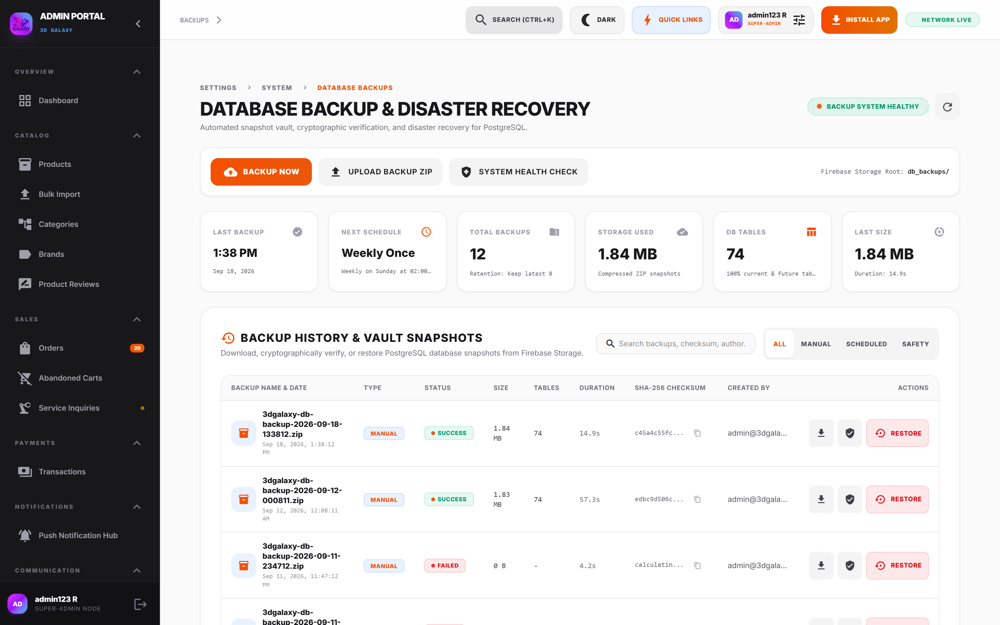
*Figure 20.1 — Database Backup & Disaster Recovery Console showing snapshot history, SHA-256 checksums, and one-click restore.*

* **Storage Repository**: Cloud Storage directory path `db_backups/`.
* **Automated Cron Schedule**: Weekly automated snapshot executed every **Sunday at 02:00 IST**.
* **Cryptographic Integrity Hashing**: Every generated archive produces a **SHA-256 hash** recorded in the backup ledger to guarantee zero data corruption.
* **Point-in-Time Restore Engine**: Allows rollbacks to any verified snapshot with automated database table purging and structured record rehydration.

### 20.2 Operational Procedures
* **Creating a Manual Backup**:
  1. Navigate to **Settings → Database Backups** (or `/admin?tab=backup`).
  2. Verify system health indicators: Database Status = `Operational`, Storage = `Accessible`.
  3. Click **Create Manual Snapshot**.
  4. Wait for the progress indicator. Verify that the new archive appears in the history table with an active status and SHA-256 checksum.
* **Restoring from a Backup**:
  1. Identify the desired snapshot in the history table by timestamp.
  2. Click **Restore**.
  3. Read and confirm the critical warning dialog.
  4. Allow the restoration sequence to complete without closing the browser window.
  5. Verify that catalog inventory and orders return to operational state.

---

## 21. BUSINESS ANALYTICS & REVENUE VELOCITY

* **Access Path**: Admin Portal → Analytics (`/admin?tab=analytics`)

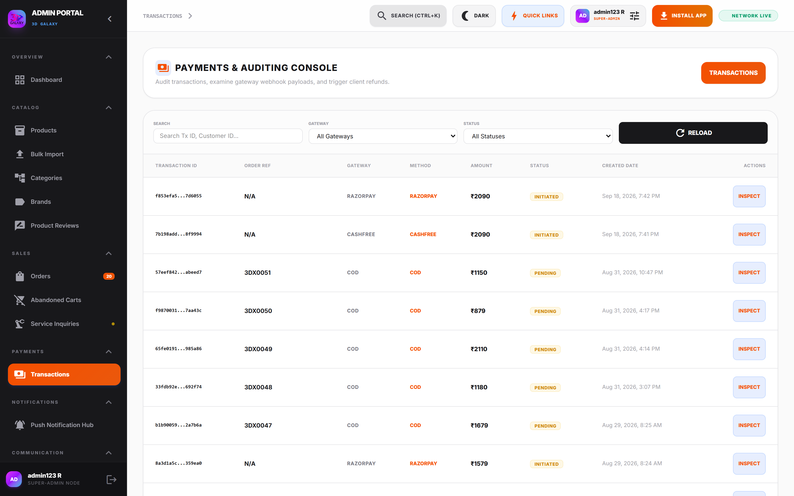
*Figure 21.1 — Business Analytics & Revenue Reporting Console tracking revenue velocity, order volumes, and catalog performance.*

### Analytical Metrics Breakdown

| Metric Name | Calculation / Meaning | Data Source | Business Purpose | Recommended Administrator Action |
| :--- | :--- | :--- | :--- | :--- |
| **Gross Merchandise Value (GMV)** | Cumulative total customer spend across all channels | Orders Collection (Razorpay + Manual) | Evaluates top-line commercial growth | Compare against quarterly financial targets |
| **Average Order Value (AOV)** | $\text{Gross Revenue} \div \text{Completed Orders}$ | Orders Ledger | Measures basket size health | Introduce bundle discounts if AOV declines |
| **Inventory Turnover Rate** | Days taken to sell physical stock units | Catalog & Sales Velocity | Identifies high-performing vs dead inventory | Issue replenishment purchase orders for high-velocity SKUs |
| **Abandoned Cart Ratio** | $\text{Abandoned Carts} \div \text{Initiated Checkouts}$ | Abandoned Checkout Sessions | Identifies checkout friction | Trigger automated push/WhatsApp recovery blasts |
| **Customer Acquisition Velocity**| New registered customer accounts per month | Users Collection | Evaluates marketing campaign ROI | Scale marketing spend on high-performing ad channels |

---

## 22. 20 PRACTICAL ADMINISTRATOR OPERATIONAL USE CASES

### Use Case 1: Create a New Retail Product
1. Navigate to **Products → Add Product**.
2. Enter Product Title (e.g., *"Bambu Lab A1 3D Printer"*), SKU (`BAMBU-A1-BASE`), and select Primary Category (*FDM Printers*).
3. Input MRP (₹39,999) and Sale Price (₹34,999). Set physical stock to 15 units.
4. Upload primary hero photo and secondary gallery images.
5. Enter calibrated shipping weight ($8,500\text{g}$).
6. Click **Publish**. Verify the product appears live on the storefront.

### Use Case 2: Configure Product Categories & Subcategories
1. Navigate to **Categories → Add Category**.
2. Enter Category Name (e.g., *"Engineering Filaments"*), slug (`engineering-filaments`), and upload banner asset.
3. Assign Parent Category if creating a subcategory.
4. Set Display Order sequence (e.g., `2` for second position in menu).
5. Click **Save Category**.

### Use Case 3: Configure a Single Color Variant
1. Open the product editor and click the **Variants** tab.
2. Add a new Variant Group titled *"Color"*, set Display Type to `color-chips`, and Selection Mode to `single`.
3. Add color values with hex codes: *Onyx Black* (`#111111`), *Signal Red* (`#FF2200`), *Galaxy Blue* (`#0066FF`).
4. Click **Generate Combination Matrix**. Allocate stock per color.
5. Save product.

### Use Case 4: Configure Multiple Variant Groups (Material × Color × Weight)
1. In the **Variants** tab, create Group 1: *Material* (`chip` — PLA, PETG, ABS).
2. Create Group 2: *Spool Weight* (`weight-selector` — 500g, 1.0kg).
3. Create Group 3: *Color* (`color-chips` — Black, White, Red).
4. Click **Generate Combination Matrix** to generate all 18 permutations.
5. Allocate stock and price overrides for each permutation.
6. Set the default combination star on *PLA - 1.0kg - Black*.
7. Save product.

### Use Case 5: Apply a Pre-Configured Variant Template
1. In the **Variants** tab, expand the **Variant Templates Library**.
2. Select **Filament Weight** from the template cards.
3. Review the preview schema (250g Sample, 500g, 1kg, 2kg, 5kg).
4. Click **Apply Template**. The template groups are appended safely without wiping existing data.
5. Adjust prices and allocate physical inventory.
6. Save product.

### Use Case 6: Configure Variant-Level Warehouse Stock
1. Open the product editor and proceed to the **Combination Matrix** table.
2. Locate the specific variant row (e.g., *PETG - Signal Red - 1kg*).
3. Update the Stock input field from `0` to `25`.
4. Click **Save Product**. The storefront immediately reflects active stock.

### Use Case 7: Configure Variant Weight for Real-Time Shipping Tariffs
1. In the **Variants** tab or **Combination Matrix**, locate the weight column.
2. Enter exact weights in grams: 250g spool $\rightarrow$ `320` (including spool tare weight), 1kg spool $\rightarrow$ `1250` (including box).
3. Save product. The courier engine uses this data to calculate accurate shipping tariffs at checkout.

### Use Case 8: Link Variant Images to Color Options
1. Open the product **Images** tab.
2. Upload photography for each colorway.
3. For the red filament photo, select *Signal Red* from the **Linked Variant** dropdown.
4. Repeat for all color options and save.
5. Verify on storefront: clicking the red chip switches the gallery to the red photo.

### Use Case 9: Configure a Multi-Tier Bundle (Buy 1, Buy 3, Buy 5)
1. In the **Variants** tab, create a group titled *"Spool Multi-Pack"*.
2. Set Display Type to `bundle-builder` and Selection Mode to `bundle`.
3. Enable **Allow Duplicate Selection in Slots**.
4. Configure Bundle Tiers:
   * *Tier 1*: Buy 1 @ ₹899 (Count: 1, Price Type: Fixed).
   * *Tier 2*: Buy 3 @ ₹799 each (Count: 3, Price Type: Per Variant, Badge: "Most Popular", Savings: "Save 11%").
   * *Tier 3*: Buy 5 @ ₹3,499 (Count: 5, Price Type: Fixed, Badge: "Best Value", Savings: "Save 22%").
5. Save product. Verify slots render on storefront.

### Use Case 10: Configure Product Shipping & Delivery Days Buffer
1. Open the product **Shipping & Delivery** tab.
2. To offer free shipping on this specific machine, toggle **Free Shipping** on.
3. Enter Delivery Days buffer: `4` (or range `3-5`).
4. Save product. The storefront renders: *"Expected Delivery by [Calculated Date]"*.

### Use Case 11: Process an Active Retail Order
1. Navigate to **Orders → Active Logs**.
2. Locate order by order code (e.g., `GLX-748920`).
3. Verify payment status is confirmed (Razorpay Payment ID present).
4. Change fulfillment status from `pending` to `processing`.
5. Warehouse team picks items and prints packing slip.

### Use Case 12: Process a Customized 3D Printing (STL) Order
1. Navigate to **Orders → STL Slicer Quotes**.
2. Inspect uploaded `.stl` file, calculated volume ($45.2\text{ cm}^3$), and selected material (Carbon Fiber Nylon).
3. Review customer notes regarding infill density and finish.
4. Input ₹1,250 in **Modify Manual Cost Override (INR)**.
5. Click **Dispatch Official Quote**. Customer receives WhatsApp quote link with checkout button.
6. Upon payment confirmation, click **Initiate Lab Cluster Fab**.

### Use Case 13: Ship an Order & Dispatch Automated Courier Tracking
1. Open the order in the **Orders** console.
2. Change status to `shipped`.
3. Select Courier Partner (*Delhivery*).
4. Enter tracking consignment number (e.g., `DEL1094857201`).
5. Click **Save & Dispatch Notification**. The customer automatically receives an email and WhatsApp message with their clickable tracking URL.

### Use Case 14: Update Courier Tracking Information
1. If a consignment number was mistyped, locate the order in **Active Logs**.
2. Open the order inspection dialog and update the tracking number.
3. Click **Update Tracking Details**. The customer's tracking link reflects the new number immediately.

### Use Case 15: Handle Inbound Customer Inquiries on WhatsApp
1. Navigate to **WhatsApp Business** from the sidebar.
2. Select the customer thread from the left pane.
3. Review the customer query alongside their CRM profile and recent orders in the right sidebar.
4. Type a direct reply and hit Enter. The message delivers instantly with delivery ticks.

### Use Case 16: Configure Automated WhatsApp Greeting & Keyword Rules
1. Navigate to **WhatsApp → Automation Settings**.
2. Enable **Default Welcome Sequence** and enter greeting copy.
3. Click **Add Keyword Rule**:
   * *Keyword*: `FILAMENT`
   * *Match Type*: `Contains`
   * *Reply*: *"Explore our complete line of engineering filaments here: https://3dgalaxy.in/category/filaments"*
4. Click **Save Automation Rules**.

### Use Case 17: Launch a Targeted Push Notification Campaign
1. Navigate to **Push Notifications → Campaign Builder**.
2. Enter Title: *"Flash Sale: 15% Off All PETG Spools!"*.
3. Enter Body text and paste promotional banner image URL.
4. Set Action Deep-Link to `/category/petg-filaments`.
5. Target Audience: *Active Buyers (Last 30 Days)*.
6. Click **Send Campaign Broadcast**.

### Use Case 18: Audit Business Analytics & Inventory Health
1. Navigate to **Analytics → Business Overview**.
2. Review Gross Revenue, Order Volumes, and Average Order Value (AOV).
3. Open **Inventory Health** tab to identify SKUs with less than 5 units remaining.
4. Generate purchase orders for replenishment.

### Use Case 19: Perform a Manual Database Backup
1. Navigate to **Settings → Database Backups** (or `/admin?tab=backup`).
2. Verify Database Status is `Operational`.
3. Click **Create Manual Snapshot**.
4. Confirm the snapshot archive appears in the ledger with an active SHA-256 hash.

### Use Case 20: Restore Database from Previous Snapshot
1. In **Settings → Database Backups**, select the target snapshot archive.
2. Click **Restore Snapshot**.
3. Confirm the modal security prompt.
4. Wait for database rehydration. Verify data integrity across Catalog and Orders upon completion.

---

## 23. END-TO-END OPERATIONAL WORKFLOWS

### 23.1 Master Product Lifecycle Workflow

```
┌─────────────────────────┐
│     CREATE PRODUCT      │
└────────────┬────────────┘
             │
             ▼
┌─────────────────────────┐
│     GENERAL DETAILS     │ ──► (Title, SKU, Brand, Base Price, Stock, Category)
└────────────┬────────────┘
             │
             ▼
┌─────────────────────────┐
│    PRODUCT IMAGES       │ ──► (Primary Hero, Multi-Angle Gallery)
└────────────┬────────────┘
             │
             ▼
┌─────────────────────────┐
│   VARIANTS & TEMPLATES  │ ──► (Apply Template or Build Custom Groups: Material × Color × Weight)
└────────────┬────────────┘
             │
             ▼
┌─────────────────────────┐
│   COMBINATION MATRIX    │ ──► (Generate Cartesian Matrix, Assign SKUs, Prices, Stock, Weights)
└────────────┬────────────┘
             │
             ▼
┌─────────────────────────┐
│     DEFAULT VARIANT     │ ──► (Set Primary Star Flag on Active Stock Permutation)
└────────────┬────────────┘
             │
             ▼
┌─────────────────────────┐
│  VARIANT IMAGE MAPPING  │ ──► (Link Color Swatches to Photography)
└────────────┬────────────┘
             │
             ▼
┌─────────────────────────┐
│   SHIPPING & SEO CONFIG │ ──► (Set Weight in grams, Delivery Days Buffer, Meta Tags)
└────────────┬────────────┘
             │
             ▼
┌─────────────────────────┐
│  LIVE STOREFRONT PREVIEW│ ──► (Validate Swatches, Prices, Stock Badges before publishing)
└────────────┬────────────┘
             │
             ▼
┌─────────────────────────┐
│     SAVE & PUBLISH      │
└────────────┬────────────┘
             │
             ▼
┌───────────────────────────────────────────────────────────┐
│                STOREFRONT COMMERCE FLOW                   │
│ Customer Selects ──► Cart ──► Checkout ──► Razorpay Order │
└───────────────────────────────────────────────────────────┘
```

---

### 23.2 Master Order Fulfillment Workflow

```
┌────────────────────────────────────────────────────────┐
│                        CUSTOMER                        │
│   Places Order via Razorpay, UPI or Verified COD       │
└───────────────────────────┬────────────────────────────┘
                            │
                            ▼
┌────────────────────────────────────────────────────────┐
│                   ADMIN ORDERS CONSOLE                 │
│   Status: PENDING ──► Verify Payment ID in Razorpay   │
└───────────────────────────┬────────────────────────────┘
                            │
                            ▼
┌────────────────────────────────────────────────────────┐
│                   ORDER PROCESSING                     │
│   Status: PROCESSING ──► Generate Warehouse Packing Slip│
└───────────────────────────┬────────────────────────────┘
                            │
                            ▼
┌────────────────────────────────────────────────────────┐
│                 WAREHOUSE PICK & PACK                  │
│   Verify SKUs, Variant Options, Weigh Packed Box       │
└───────────────────────────┬────────────────────────────┘
                            │
                            ▼
┌────────────────────────────────────────────────────────┐
│                   COURIER DISPATCH                     │
│   Handover to Bluedart / Delhivery / DTDC              │
│   Enter Consignment Tracking Number in Order Record    │
│   Status: SHIPPED                                      │
└───────────────────────────┬────────────────────────────┘
                            │
                            ▼
┌────────────────────────────────────────────────────────┐
│               AUTOMATED OMNICHANNEL ALERT              │
│   Customer receives WhatsApp & Email with Tracking Link│
└───────────────────────────┬────────────────────────────┘
                            │
                            ▼
┌────────────────────────────────────────────────────────┐
│                  FULFILLMENT COMPLETE                  │
│   Courier confirms delivery ──► Status: COMPLETED       │
│   System prompts customer for Storefront Review        │
└────────────────────────────────────────────────────────┘
```

---

## 24. CLIENT OPERATING CHECKLISTS

### 24.1 Pre-Publishing Checklist (Products)
- [ ] **Product Title**: Canonical, includes brand name, technology, and model.
- [ ] **SKU Identifier**: Unique, matches warehouse bin coding standard.
- [ ] **Category**: Primary category assigned; secondary tags attached.
- [ ] **Brand**: Correct manufacturer assigned (Creality, Bambu Lab, 3D Galaxy).
- [ ] **Pricing**: MRP and Sale Price entered; Dealer Price set if applicable.
- [ ] **Physical Stock**: Stock count allocated (on base or variant level).
- [ ] **Photography**: High-resolution images uploaded (min 1000×1000px, WebP/PNG).
- [ ] **Variant Groups**: Correct display types selected (e.g., `color-chips` for colors).
- [ ] **Combination Matrix**: Generated, prices and stocks verified for all rows.
- [ ] **Default Variant**: Star icon set on an in-stock variant combination.
- [ ] **Variant Images**: Color-specific photos mapped in the *Images* tab.
- [ ] **Calibrated Weight**: Accurate parcel weight entered in grams.
- [ ] **Shipping Rules**: Free shipping toggle or custom shipping fees verified.
- [ ] **Delivery Days**: Estimated delivery days buffer entered (e.g., 3–5 Days).
- [ ] **SEO Meta Tags**: Meta title and description entered with focus keywords.
- [ ] **Live Preview**: Checked in Live Preview tab for responsive accuracy.
- [ ] **Publish**: Status toggle set to Active Storefront.

---

### 24.2 Pre-Fulfillment Checklist (Orders)
- [ ] **Payment Verification**: Payment status confirmed (Razorpay ID valid or COD approved).
- [ ] **Customer Profile**: Verified recipient name, phone number, and complete PIN code.
- [ ] **GST Compliance**: 15-digit GSTIN verified if B2B tax invoice requested.
- [ ] **Inventory Match**: Physical stock confirmed in warehouse bin.
- [ ] **Variant Specifics**: Verified exact booked options (Color, Spool Weight, Nozzle).
- [ ] **Custom Manufacturing**: Reviewed slicing parameters ($cm^3$, mass, infill) for STL jobs.
- [ ] **Packing Slip**: Printed and placed inside shipping container.
- [ ] **Parcel Weighing**: Verified gross packaged weight matches courier tariff.
- [ ] **Courier Tracking**: Tracking number entered in order record before parcel handover.
- [ ] **Status Advance**: Fulfillment status updated to `shipped`.
- [ ] **Notification Dispatch**: Verified automated WhatsApp/email tracking alert triggered.

---

## 25. COMPREHENSIVE OPERATIONAL TROUBLESHOOTING GUIDE

| Symptom / Problem | Probable Root Cause | Administrative Check | Resolution Procedure |
| :--- | :--- | :--- | :--- |
| **Product not visible on storefront** | Product status is "Draft" or no category is assigned | Check product editor header status toggle and category dropdown | Set toggle to "Active Storefront" and ensure at least one published category is selected. |
| **Variant dropdown empty on product page** | Variant values inactive or Combination Matrix not generated | Open Variants tab and inspect Combination Matrix | Verify active toggles on all values and click "Generate Combination Matrix". |
| **Default variant shows "Sold Out"** | Default variant combination has zero physical stock | Check Combination Matrix table for the row with the star icon | Reallocate stock to the default combination or move the default star to an in-stock variant. |
| **Photos do not switch when clicking color chips** | Uploaded photos not linked to variant values | Open Images tab and check the "Linked Variant" dropdown per photo | Map each uploaded photo to its corresponding color variant value and save. |
| **Customer cannot checkout: "Out of Stock"** | Variant-level stock is zero even if base product stock > 0 | Check Combination Matrix stock column for requested permutation | Allocate stock directly to the specific variant combination in the matrix table. |
| **Incorrect shipping fee calculated at checkout** | Product weight missing or shipping rules misconfigured | Inspect product weight field (grams) and Settings → Shipping | Enter accurate weight in grams; audit free shipping threshold under Settings → Shipping. |
| **Delivery date shows past date or error** | Delivery days buffer is set to zero or missing | Open Shipping tab in product editor | Set delivery days buffer to an integer $\ge 1$ (e.g., `4` or range `3-5`). |
| **Inbound WhatsApp messages not appearing in inbox** | Webhook disconnected or Meta Cloud API token expired | Check Settings → WhatsApp and inspect Meta connection status | Verify Meta WhatsApp Cloud API credentials in Settings; test webhook challenge URL. |
| **Push notification broadcast fails** | FCM server key invalid or audience segment empty | Check Settings → Admin Devices & Notifications | Verify Firebase Cloud Messaging credentials under Settings; ensure subscribers exist. |
| **Order stuck in "Pending" status after payment** | Razorpay payment webhook delayed or dropped | Check Razorpay dashboard using order amount and customer email | Locate Payment ID in Razorpay; manually update order status to `processing` in portal. |
| **Analytics metrics show zero or not updating** | Browser ad-blocker active or caching lag | Disable ad-blockers on admin domain; check network tab | Ensure ad-blockers are paused; click "Reload Telemetry" in Analytics header. |
| **Database backup fails to complete** | Cloud Storage bucket permission issue or quota exceeded | Check Settings → Database Backups storage health widget | Verify Firebase Storage service account permissions on `db_backups/` path. |

---

## 26. APPENDIX: SYSTEM ARCHITECTURE SPECIFICATIONS

### Production Environment Specifications
* **Frontend Architecture**: Angular 19 Enterprise Single-Page Application (SPA) with Signal State Management.
* **Component Styling**: Clean Vanilla Tailwind utility system with responsive dark/light enterprise themes.
* **Database & Cloud Storage**: Google Cloud Firestore & Firebase Storage (`db_backups/`).
* **Omnichannel Messaging**: Meta WhatsApp Cloud API (Graph API v20.0) with bidirectional webhooks.
* **Payment Processing Suite**: Razorpay Payment Suite (Standard Checkout & Automated Webhooks).
* **Omnichannel Tracking**: Meta Conversions API (CAPI), Meta Pixel, Google Analytics 4, Google Tag Manager, Google Ads.
* **Push Notification Infrastructure**: Firebase Cloud Messaging (FCM HTTP v1 API).

---

## 27. DOCUMENT HANDOVER & ACCEPTANCE

```
========================================================================================
                          DOCUMENT HANDOVER & ACCEPTANCE
========================================================================================
```

This Standard Operating Procedure document confirms the formal handover of the **3D Galaxy Admin Portal** from **AJR Digital Hub** to the **3D Galaxy Operations Team**. By signing below, both parties acknowledge that all 30 administrative modules, variant engines, shipping calculators, WhatsApp automations, and disaster recovery engines have been audited, demonstrated, and delivered in fully operational condition.

---

### DELIVERED BY

**AJR Digital Hub Team**  
Enterprise Digital Solutions Team  
AJR Digital Hub  

Signature: ____________________________________  

Date: ________________________________________  

---

### ACCEPTED BY

**3D Galaxy Team**  
E-Commerce Operations & Store Administration  
3D Galaxy  

Signature: ____________________________________  

Date: ________________________________________  

```
========================================================================================
                       AJR DIGITAL HUB  ──►  3D GALAXY (2026)
                        WHERE IDEAS MEET INNOVATION
========================================================================================
```
