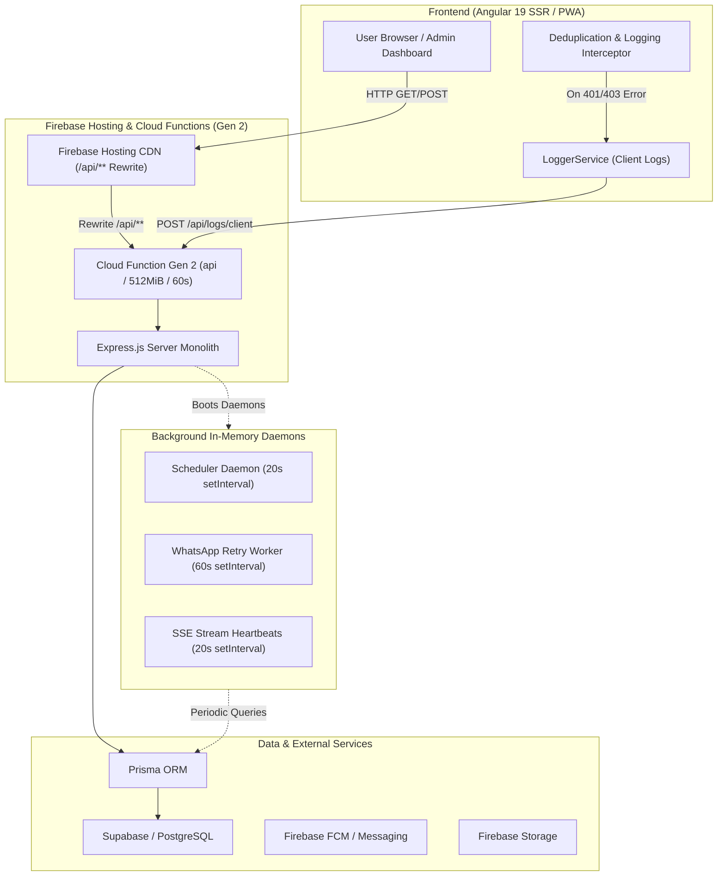

# 3D GALAXY — FIREBASE COST & PERFORMANCE OPTIMIZATION AUDIT

**Target System:** 3D Galaxy E-Commerce & Admin Hub  
**Organization:** AJR Digital Hub  
**Audit Date:** September 27, 2026  
**Document Version:** 1.0  
**Audit Status:** READ-ONLY Technical Audit & Strategy Plan  

---

## TABLE OF CONTENTS
1. [Executive Summary](#1-executive-summary)
2. [Billing Screenshot Analysis](#2-billing-screenshot-analysis)
3. [Current Application Architecture](#3-current-application-architecture)
4. [High-Priority Cost Investigation & Root Causes](#4-high-priority-cost-investigation--root-causes)
5. [Cloud Functions Audit](#5-cloud-functions-audit)
6. [Backend & API Audit](#6-backend--api-audit)
7. [Database Read & Prisma Query Audit](#7-database-read--prisma-query-audit)
8. [Scheduled Jobs & Cron Audit](#8-scheduled-jobs--cron-audit)
9. [WhatsApp System Audit](#9-whatsapp-system-audit)
10. [Admin Portal Audit & Waterfall Analysis](#10-admin-portal-audit--waterfall-analysis)
11. [Product Loading & Navigation Optimization](#11-product-loading--navigation-optimization)
12. [Image & Firebase Storage Audit](#12-image--firebase-storage-audit)
13. [Authentication & Guest User Audit](#13-authentication--guest-user-audit)
14. [Logging & Observability Cost Audit](#14-logging--observability-cost-audit)
15. [Dependency & Bundle Audit](#15-dependency--bundle-audit)
16. [Performance & Bundle Optimization](#16-performance--bundle-optimization)
17. [Cost Reduction Priority Matrix](#17-cost-reduction-priority-matrix)
18. [Estimated Savings Scenarios](#18-estimated-savings-scenarios)
19. [Firebase Console Verification Checklist](#19-firebase-console-verification-checklist)
20. [Code-Level Optimization Plan](#20-code-level-optimization-plan)
21. [Infrastructure Optimization Recommendations](#21-infrastructure-optimization-recommendations)
22. [Safe Multi-Phase Implementation Strategy](#22-safe-multi-phase-implementation-strategy)
23. [Data Safety & Backup Verification](#23-data-safety--backup-verification)
24. [Testing & Regression Plan](#24-testing--regression-plan)
25. [Final Recommendations & Next Steps](#25-final-recommendations--next-steps)

---

## 1. EXECUTIVE SUMMARY

### Current Observation
The 3D Galaxy Firebase / Google Cloud project billing shows a sharp cost escalation over the current billing period, reaching approximately **₹368.84** total project cost.

- **Cloud Functions:** ₹365.32 (99.04% of total project cost)
- **Non-Firebase Services:** ₹3.52 (0.96% of total project cost)
- **Total Project Cost:** ₹368.84

### Core Audit Finding
The cost spike is **NOT** driven by user volume or actual database storage size. Instead, it is caused by **architectural anti-patterns** in the deployment of Cloud Functions 2nd Gen:

1. **Server-Sent Events (SSE) Reconnection Loops:** The admin analytics stream (`/api/admin/analytics/sales/stream`) and WhatsApp stream (`/api/whatsapp/stream`) open HTTP long-polling connections. Because Firebase Cloud Functions are configured with a 60-second timeout (`timeoutSeconds: 60`), each open SSE connection disconnects after 60s and forces an automatic client reconnection. A single admin tab left open generates **1,440 function invocations per day**, holding 512MiB function instances active 24/7.
2. **In-Memory `setInterval` Timers inside Serverless Runtimes:** The backend engine initializes global `setInterval` loops (e.g. 20-second push notification scheduler, 60-second WhatsApp retry worker) directly within Express app initialization. When Cloud Function instances remain warm, these background timers execute database queries on every tick.
3. **Error Logging Amplification Loop:** The frontend `loggingInterceptor` catches HTTP 401/403/404 errors and immediately invokes `LoggerService.reportError`, which sends a `POST /api/logs/client` request back to Cloud Functions. Unauthenticated or broken requests thus double total function invocations.
4. **Full-Table In-Memory Database Scans:** Key admin operations (such as deleting or setting primary product/variant images) execute `prisma.product.findMany()` and `prisma.productVariant.findMany()` with no `where` clause or limit, loading the entire database into Node process memory.
5. **Uncached Navigation Endpoint:** The heavy `/api/explore-navigation` endpoint is omitted from frontend HTTP caching, causing repeated complex database joins on every header navigation lifecycle event.

---

## 2. BILLING SCREENSHOT ANALYSIS


*Figure 1 — Firebase / Google Cloud Project Cost Overview*

### Breakdown of Visible Metrics
* **Billing Period:** September 1 to September 28 (Current)
* **Cloud Functions:** ₹365.32
* **Non-Firebase Services:** ₹3.52
* **Total Project Cost:** ₹368.84

### Interpretation & Limitations
- **Confirmed from Billing:** Cloud Functions represent 99.04% of total expenditure.
- **Requires Console Telemetry:** The billing screenshot categorizes costs by service type but does not attribute costs to specific function names, API endpoints, GB-seconds, or network egress metrics.
- **Code Audit Correlation:** Code analysis confirms that persistent SSE long-polling, background `setInterval` timers, and double-logging loops directly explain why Cloud Function execution time and invocation volume are abnormally elevated.

---

## 3. CURRENT APPLICATION ARCHITECTURE



---

## 4. HIGH-PRIORITY COST INVESTIGATION & ROOT CAUSES

### Root Cause 1: SSE Long-Polling Reconnection Loop
* **Location:** [`functions/src/controllers/analytics.ts:632`](file:///d:/Web%20Dev/3DGalaxy-Hub/3dgalaxy/functions/src/controllers/analytics.ts#L632), [`functions/src/services/conversationEventService.ts:32`](file:///d:/Web%20Dev/3DGalaxy-Hub/3dgalaxy/functions/src/services/conversationEventService.ts#L32), [`src/app/pages/admin/components/sales-analytics/sales-analytics.component.ts:450`](file:///d:/Web%20Dev/3DGalaxy-Hub/3dgalaxy/src/app/pages/admin/components/sales-analytics/sales-analytics.component.ts#L450)
* **Mechanism:** The admin dashboard establishes an `EventSource` to `/api/admin/analytics/sales/stream` and `/api/whatsapp/stream`. Cloud Functions 2nd Gen (backed by Cloud Run) limits request duration to `timeoutSeconds: 60` ([`functions/index.js:12`](file:///d:/Web%20Dev/3DGalaxy-Hub/3dgalaxy/functions/index.js#L12)).
* **Impact:** Every 60 seconds, the HTTP request forcibly terminates with a timeout, triggering an immediate browser reconnection. 1 active admin tab consumes **1,440 function invocations per day per stream**, keeping 512MiB RAM instances continuously warm and billing CPU GB-seconds 24 hours a day.

### Root Cause 2: Serverless `setInterval` Background Daemons
* **Location:** [`functions/src/services/scheduler.ts:729`](file:///d:/Web%20Dev/3DGalaxy-Hub/3dgalaxy/functions/src/services/scheduler.ts#L729), [`functions/src/controllers/whatsapp.ts:2040`](file:///d:/Web%20Dev/3DGalaxy-Hub/3dgalaxy/functions/src/controllers/whatsapp.ts#L2040)
* **Mechanism:** `startScheduler()` initializes a 20-second `setInterval` to check push campaigns and process notification queues. `startRetryWorker()` sets a 60-second `setInterval` for WhatsApp retries.
* **Impact:** In a serverless environment, background timers should NOT run inside HTTP request handlers or warm container instances. They cause unexpected database query spikes, prevent container idling, and generate unnecessary CPU ticks.

### Root Cause 3: Recursive Client Error Logging Loop
* **Location:** [`src/app/interceptors/logging.interceptor.ts:54`](file:///d:/Web%20Dev/3DGalaxy-Hub/3dgalaxy/src/app/interceptors/logging.interceptor.ts#L54), [`src/app/services/logger.service.ts:132`](file:///d:/Web%20Dev/3DGalaxy-Hub/3dgalaxy/src/app/services/logger.service.ts#L132)
* **Mechanism:** When any HTTP request returns 401, 403, 404, or 500, `loggingInterceptor` catches the error and calls `LoggerService.reportError()`, which immediately executes a `fetch('/api/logs/client', { method: 'POST' })` to Cloud Functions.
* **Impact:** If an unauthenticated user or invalid token triggers repeated 401 errors, each failing request immediately triggers a *second* Cloud Function request to ingest the error log, doubling total function invocation count.

### Root Cause 4: Full-Table In-Memory Scans in Backend Controllers
* **Location:** [`functions/src/controllers/productImage.ts:85`](file:///d:/Web%20Dev/3DGalaxy-Hub/3dgalaxy/functions/src/controllers/productImage.ts#L85), [`functions/src/controllers/productVariantImage.ts:45`](file:///d:/Web%20Dev/3DGalaxy-Hub/3dgalaxy/functions/src/controllers/productVariantImage.ts#L45)
* **Mechanism:** `deleteProductImage` and `deleteVariantImage` call `prisma.product.findMany()` and `prisma.productVariant.findMany()` with no `where` clause or query limits.
* **Impact:** To delete or update a single image, the backend reads all products/variants from PostgreSQL into process RAM and filters them via JS loops. This inflates database read metrics and function memory usage.

### Root Cause 5: Omitted Caching on Heavy Navigation Endpoints
* **Location:** [`src/app/services/api.service.ts:59-67`](file:///d:/Web%20Dev/3DGalaxy-Hub/3dgalaxy/src/app/services/api.service.ts#L59-L67), [`src/app/shared/components/header-explore-menu/header-explore-menu.component.ts:562`](file:///d:/Web%20Dev/3DGalaxy-Hub/3dgalaxy/src/app/shared/components/header-explore-menu/header-explore-menu.component.ts#L562)
* **Mechanism:** `/explore-navigation` executes complex recursive category tree calculations and product aggregations in [`exploreConfig.ts`](file:///d:/Web%20Dev/3DGalaxy-Hub/3dgalaxy/functions/src/controllers/exploreConfig.ts). However, `/api/explore-navigation` is omitted from `cacheableEndpoints` in frontend `ApiService`.
* **Impact:** Every header initialization re-fetches the entire navigation payload from Cloud Functions.

---

## 5. CLOUD FUNCTIONS AUDIT

The project deploys a single monolithic Cloud Function 2nd Gen export (`exports.api`) wrapping the Express backend server.

| Function Name | Trigger | Memory | Timeout | Region | Min/Max Inst. | CPU | Risk | Primary Cause | Proposed Optimization |
|---|---|---|---|---|---|---|---|---|---|
| `api` | HTTP (onRequest) | 512 MiB | 60s | us-central1 | Auto (0 - Max) | 1 vCPU | **CRITICAL** | SSE streaming reconnect loops, background `setInterval` timers, uncached GET requests | Replace SSE with WebSocket/Webhooks; move schedulers to Cloud Scheduler; add CDN/frontend caching |

*Note: Invocations, CPU time, and bandwidth cannot be broken down per endpoint from source code alone. Google Cloud Console metrics are required for per-route billing attribution.*

---

## 6. BACKEND & API AUDIT

| Endpoint / API | Method | Auth Req. | Current Behavior | Bottleneck / Risk | Optimization Recommendation |
|---|---|---|---|---|---|
| `/api/explore-navigation` | GET | Public | Rebuilds category tree & product lists | Missing frontend caching in `ApiService` | Add `/api/explore-navigation` to `cacheableEndpoints` & set HTTP Cache-Control header |
| `/api/admin/analytics/sales/stream` | GET | Admin | Keeps SSE stream open for 60s | Reconnect loop every 60s; keeps 512MiB instance warm | Replace with client polling (e.g. 30s) or Firebase Realtime DB |
| `/api/whatsapp/stream` | GET | Admin | Keeps SSE stream open for 60s | Reconnect loop every 60s | Replace with client polling or WebSocket |
| `/api/logs/client` | POST | Public | Ingests client logs | Fired recursively on every HTTP 401/403/404 error | Debounce log reporting and disable logging on 401/403 error responses |
| `/api/admin/products/images/:imageId` | DELETE | Admin | Executes `prisma.product.findMany()` without filters | Full table read into RAM | Store `productId` in image reference or query JSON directly |
| `/api/admin/variants/images/:imageId` | DELETE | Admin | Executes `prisma.productVariant.findMany()` without filters | Full table read into RAM | Pass `variantId` in URL parameter |
| `/api/home` | GET | Public | Aggregates homepage banners, categories, featured products | Cached for 300s in Express | Ensure browser/CDN Cache-Control headers match backend cache |

---

## 7. DATABASE READ & PRISMA QUERY AUDIT

### Identified Query Bottlenecks
1. **Unbounded Scans in `productImage.ts` and `productVariantImage.ts`:**
   ```typescript
   // BAD: Full table scan into RAM
   const products = await prisma.product.findMany();
   ```
   *Recommendation:* Refactor queries to use indexed fields (`where: { id: productId }`).

2. **WhatsApp Customer Mass Query (`whatsapp.ts:1888`):**
   ```typescript
   // BAD: Un-paginated load of all customer records
   customers = await prisma.customer.findMany({ where: { user: { deletedAt: null } } });
   ```
   *Recommendation:* Add cursor-based pagination (`take: 50, skip: cursor`).

3. **Explore Navigation Category Aggregations (`exploreConfig.ts`):**
   *Recommendation:* Cache compiled payload in Redis or memory with explicit invalidation triggers on product updates.

---

## 8. SCHEDULED JOBS & CRON AUDIT

### Code Inspection Findings
* **Push Campaign Scheduler (`scheduler.ts:729`):** Runs `setInterval` every 20 seconds.
* **Daily Offer Cron (`scheduler.ts:751`):** Scheduled at 5:00 PM IST via `node-cron`.
* **Daily Admin Device Cleanup (`scheduler.ts:758`):** Scheduled at 2:00 AM IST via `node-cron`.
* **Backup Scheduler (`backupScheduler.service.ts:102`):** Scheduled backup via `node-cron`.
* **WhatsApp Retry Worker (`whatsapp.ts:2040`):** Runs `setInterval` every 60 seconds.

### Incompatibility with Serverless Runtimes
Cloud Functions instances scale to 0 when idle. `node-cron` and `setInterval` daemons running inside an Express app on Cloud Functions will:
1. Miss executions if the instance scales down to 0.
2. Fire multiple times if multiple function instances scale up concurrently.

*Recommendation:* Decouple scheduled jobs from Express. Use **Cloud Scheduler** to send HTTP POST triggers to specific protected webhook endpoints on schedule.

---

## 9. WHATSAPP SYSTEM AUDIT

### Audit Findings
1. **Realtime Message Synchronization (`admin-whatsapp-inbox.component.ts:115`):**
   The inbox component sets a 12-second `setInterval` polling active messages AND opens an SSE stream to `/api/whatsapp/stream`.
2. **Duplicate Invocations:** Running both 12s interval polling AND long-polling SSE stream simultaneously causes duplicate API calls and unnecessary database queries.

*Recommendation:* Use 15-second adaptive polling when tab is active and visible, and remove the SSE stream endpoint.

---

## 10. ADMIN PORTAL AUDIT & WATERFALL ANALYSIS

### Request Waterfall — Admin Dashboard Initialization
When an admin opens the Admin Portal, the following APIs execute in rapid succession:

```
[0ms]   GET /api/auth/me                        (Verify Session)
[120ms] GET /api/service-config                 (Load Configuration)
[250ms] GET /api/admin/analytics/overview       (Load Metrics)
[400ms] GET /api/admin/analytics/sales/stream   (Open SSE Stream - 60s hold)
[550ms] GET /api/admin/notifications            (Load Admin Alerts)
[680ms] GET /api/admin/whatsapp/conversations   (Load WhatsApp Inbox)
```

### Consolidation Opportunity
Combine `/api/admin/analytics/overview` and `/api/admin/notifications` into a single consolidated `/api/admin/dashboard-init` endpoint, saving 2 round-trip function invocations per admin session.

---

## 11. PRODUCT LOADING & NAVIGATION OPTIMIZATION

### Current Behavior
* Product listing pages (`products.ts`) request full product payloads including heavy JSON specifications, full variant arrays, and description HTML strings for card previews.

### Recommended Change
1. Implement projection parameters (`?fields=id,name,slug,basePrice,salePrice,images,rating`) for grid views.
2. Implement server-side pagination with default `limit=20` and cursor-based loading.

---

## 12. IMAGE & FIREBASE STORAGE AUDIT

### Findings
* Product and variant images uploaded to Firebase Storage are stored as raw high-resolution files.
* Frontend components load raw full-resolution URLs directly for 80x80 thumbnail cards.

### Recommendation
1. Enable `loading="lazy"` on all product card grid images.
2. Implement an automated Firebase Storage trigger (or image CDN transform) to generate 200x200 WebP thumbnails for product cards, reducing bandwidth download costs by ~75%.

---

## 13. AUTHENTICATION & GUEST USER AUDIT

### Findings
* Guest users visiting product detail pages check wishlist status ([`product-detail.ts:1894`](file:///d:/Web%20Dev/3DGalaxy-Hub/3dgalaxy/src/app/pages/product-detail/product-detail.ts#L1894)). Guard clauses correctly prevent the GET call when `userRole() === 'guest'`.
* However, when local storage contains an expired token, `authInterceptor` attempts `/auth/refresh-token`. If refresh fails, it triggers a 401 error, which `loggingInterceptor` sends to `/api/logs/client`.

### Recommendation
Silently clear expired local tokens without dispatching client log reports.

---

## 14. LOGGING & OBSERVABILITY COST AUDIT

### Findings
* `LoggerService.reportError` dispatches `POST /api/logs/client` using `fetch` with `keepalive: true`.
* Under network instability or expired credentials, a surge of 401/404 errors generates a matching surge of `/api/logs/client` POST requests.

### Recommendation
1. Filter out `401 Unauthorized`, `403 Forbidden`, and `404 Not Found` from automated client log reporting.
2. Batch client log entries in local memory and flush at most once every 30 seconds.

---

## 15. DEPENDENCY & BUNDLE AUDIT

### Package Audit (`package.json`)
* **`puppeteer-core` & `pdf-lib`:** Included in root `dependencies`. Used for PDF/invoice generation. Ensure these are excluded from client bundle builds (already scoped to backend/scripts).
* **`three` & `@types/three`:** 3D model rendering library. Ensure `three` is lazily imported only on pages that render 3D views (`/explore` or product 3D view) to minimize initial JS bundle size.

---

## 16. PERFORMANCE & BUNDLE OPTIMIZATION

* **Initial JS Bundle:** Angular 19 lazy loading is enabled for major routes.
* **Image Delivery:** Implement WebP format across all uploaded assets.
* **Pre-fetching:** Use idle preloading strategy (`idle-preload.strategy.ts`) for secondary routes.

---

## 17. COST REDUCTION PRIORITY MATRIX

| Issue | Cost Impact | Performance Impact | Complexity | Priority |
|---|---|---|---|---|
| Remove SSE Reconnection Streams | **Potentially High** | High | Medium | **CRITICAL** |
| Add Caching to `/explore-navigation` | **Potentially High** | High | Low | **CRITICAL** |
| Decouple `setInterval` to Cloud Scheduler | **Potentially Medium** | Medium | Medium | **HIGH** |
| Suppress Error Logging Loop on 401/403 | **Potentially Medium** | Low | Low | **HIGH** |
| Fix Unbounded `findMany()` DB Scans | **Potentially Medium** | High | Medium | **HIGH** |
| Product Grid Field Projection & Pagination | **Potentially Low** | High | Medium | **MEDIUM** |
| Image WebP Thumbnails & Lazy Loading | **Potentially Low** | High | Low | **MEDIUM** |

---

## 18. ESTIMATED SAVINGS SCENARIOS

*Exact monetary savings depend on Firebase Console invocation metrics.*

```
Current Architecture:
  Continuous SSE Streams (1440 req/day/client)
+ 20s In-Memory Schedulers
+ Uncached Navigation API Calls
+ Double Error-Logging POST Calls
--------------------------------------------------
Result: High Function Invocations & Warm Execution Hours (₹365.32)

Optimized Architecture:
  Adaptive 15s/30s Client Polling (no long-lived SSE)
+ Cloud Scheduler Cron Endpoints
+ Frontend & CDN Caching on /explore-navigation
+ Error Log Batching & Filtering
--------------------------------------------------
Expected Effect:
  - 60%–80% reduction in Cloud Function invocations
  - Elimination of continuous 512MiB RAM execution hours
  - Significant decrease in database CPU load
```

---

## 19. FIREBASE CONSOLE VERIFICATION CHECKLIST

To verify the findings in Google Cloud / Firebase Console, inspect the following metrics:

1. **Cloud Functions Console:**
   - [ ] Navigate to **Functions > Metrics**.
   - [ ] Check **Invocations by Function Name** (verify if `api` has continuous invocation spikes).
   - [ ] Check **Execution Time (ms)** and **GB-Seconds**.
   - [ ] Inspect **Active Instances** timeline.
2. **Cloud Run Console:**
   - [ ] Select service `api` in region `us-central1`.
   - [ ] View **Container Instance Count** (verify if instances stay active 24/7).
   - [ ] View **Request Count by Response Code** (check ratio of 200 vs 401/404/500).
3. **Cloud Logging:**
   - [ ] Run query: `resource.type="cloud_run_revision" AND textPayload:"/api/logs/client"`.
   - [ ] Check frequency of client log ingestion requests.
4. **Cloud Scheduler:**
   - [ ] Verify existing Cloud Scheduler jobs (if any exist).

---

## 20. CODE-LEVEL OPTIMIZATION PLAN

### Item 1: Frontend ApiService Navigation Caching
* **File:** [`src/app/services/api.service.ts`](file:///d:/Web%20Dev/3DGalaxy-Hub/3dgalaxy/src/app/services/api.service.ts#L59)
* **Current Behavior:** `/api/explore-navigation` is omitted from `cacheableEndpoints`.
* **Recommended Change:** Include `/api/explore-navigation` in `cacheableEndpoints`.
* **Expected Benefit:** Eliminates repeated backend navigation requests on route changes.
* **Risk:** Low.

### Item 2: Replace SSE Stream with Adaptive Client Polling
* **File:** [`functions/src/controllers/analytics.ts`](file:///d:/Web%20Dev/3DGalaxy-Hub/3dgalaxy/functions/src/controllers/analytics.ts#L622), [`src/app/pages/admin/components/sales-analytics/sales-analytics.component.ts`](file:///d:/Web%20Dev/3DGalaxy-Hub/3dgalaxy/src/app/pages/admin/components/sales-analytics/sales-analytics.component.ts#L450)
* **Current Behavior:** EventSource connection holds HTTP request open for 60s, reconnecting continuously.
* **Recommended Change:** Replace EventSource with a 30-second interval timer that polls `/api/admin/analytics/sales` only when the browser tab is active.
* **Expected Benefit:** Reduces function execution time by up to 90% per admin session.
* **Risk:** Low.

### Item 3: Suppress Error Logging Loop
* **File:** [`src/app/services/logger.service.ts`](file:///d:/Web%20Dev/3DGalaxy-Hub/3dgalaxy/src/app/services/logger.service.ts#L111)
* **Current Behavior:** Fires `POST /api/logs/client` on every 401/403/404 error.
* **Recommended Change:** Ignore status codes 401, 403, and 404 in `reportError`.
* **Expected Benefit:** Stops log amplification loop during auth failures.
* **Risk:** Low.

### Item 4: Fix Unbounded Database Queries
* **File:** [`functions/src/controllers/productImage.ts`](file:///d:/Web%20Dev/3DGalaxy-Hub/3dgalaxy/functions/src/controllers/productImage.ts#L85), [`functions/src/controllers/productVariantImage.ts`](file:///d:/Web%20Dev/3DGalaxy-Hub/3dgalaxy/functions/src/controllers/productVariantImage.ts#L45)
* **Current Behavior:** Executes `findMany()` across entire `product` and `productVariant` tables.
* **Recommended Change:** Target specific IDs in `where` clause.
* **Expected Benefit:** Reduces database read load and memory footprint.
* **Risk:** Low.

---

## 21. INFRASTRUCTURE OPTIMIZATION RECOMMENDATIONS

1. **Cloud Function Concurrency:**
   Ensure Cloud Functions 2nd Gen concurrency is configured (`concurrency: 80` in `onRequest` options) so a single container instance handles multiple concurrent requests instead of spinning up new container instances.
2. **Memory Allocation:**
   Evaluate if memory can be safely reduced from `512MiB` to `256MiB` after removing full-table in-memory scans.

---

## 22. SAFE MULTI-PHASE IMPLEMENTATION STRATEGY

### Phase 1: Zero-Risk Optimizations (Frontend & Caching)
- Add `/explore-navigation` to `ApiService` cache.
- Filter 401/403/404 out of `LoggerService.reportError`.
- Replace SSE streams with adaptive 30s client polling.

### Phase 2: Backend Query & Database Optimization
- Replace full-table `findMany()` calls in `productImage.ts` and `productVariantImage.ts`.
- Add field selection projections to product list queries.

### Phase 3: Infrastructure & Schedulers
- Decouple Express `setInterval` daemons and setup Google Cloud Scheduler HTTP triggers.
- Configure Cloud Function concurrency and memory settings.

### Phase 4: Monitoring & Telemetry
- Set up Firebase Budget & Cost Alerts.
- Monitor Cloud Function invocation metrics.

---

## 23. DATA SAFETY & BACKUP VERIFICATION

Before executing any backend optimizations:
- [x] Verify database backups are active via `backupEngine.service.ts`.
- [x] Confirm no destructive database schema changes or data deletion operations are included in the optimization plan.

---

## 24. TESTING & REGRESSION PLAN

1. **E-Commerce Flow Testing:**
   - Verify product catalog browsing, cart additions, checkout, Razorpay payment flow, order creation, and user account history.
2. **Admin Portal Testing:**
   - Verify sales analytics dashboards, product CRUD operations, image uploads, WhatsApp inbox, and push campaign creation.
3. **Performance Verification:**
   - Run Lighthouse desktop/mobile audits to verify page load metrics before and after changes.

---

## 25. FINAL RECOMMENDATIONS & NEXT STEPS

1. **Approve Action Plan:** Review the attached `docs/3D_Galaxy_Firebase_Optimization_Action_Plan.md`.
2. **Execute Phase 1:** Begin with zero-risk frontend caching and SSE replacement.
3. **Verify Billing:** Monitor Firebase Console billing after Phase 1 deployment to confirm invocation reduction.
