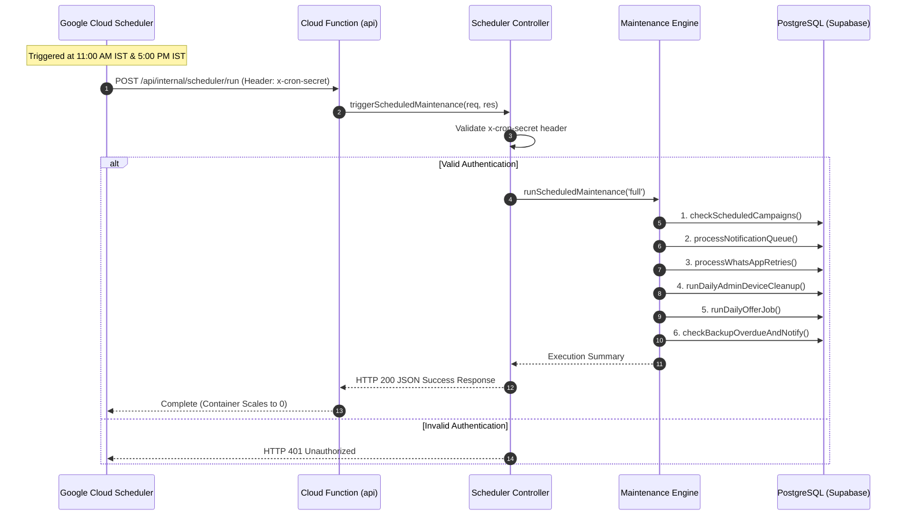

# 3D GALAXY — CENTRALIZED SCHEDULER ARCHITECTURE

**Target System:** 3D Galaxy E-Commerce & Admin Hub  
**Organization:** AJR Digital Hub  
**Document Version:** 1.0  

---

## 1. ARCHITECTURE OVERVIEW

To comply with serverless best practices for Cloud Functions Gen 2, all server-side background `setInterval` daemons and `node-cron` tasks have been decoupled from the Express web server process.

In place of in-process background daemons, a **centralized, protected HTTP scheduler architecture** has been introduced.



---

## 2. PROTECTED SCHEDULER ENDPOINT SPECIFICATION

* **HTTP Method:** `POST` / `GET`
* **Route URLs:**
  - `/api/internal/scheduler/run`
  - `/api/scheduler/run`
* **Security Authentication:**
  - Request header: `x-cron-secret: <CRON_SECRET>`
  - OR Bearer token: `Authorization: Bearer <CRON_SECRET>`
  - OR Authenticated Admin session token
* **Default Secret:** Configured via environment variable `CRON_SECRET` in `functions/.env`.

### Request Body Parameters (Optional)
```json
{
  "jobType": "full" // Options: "full", "morning_run", "evening_run", "daily_offer", "daily_cleanup"
}
```

### Response Example (HTTP 200 OK)
```json
{
  "success": true,
  "message": "Scheduled maintenance executed successfully.",
  "results": {
    "timestamp": "2026-09-27T23:20:00.000Z",
    "jobType": "full",
    "jobsExecuted": [
      "checkScheduledCampaigns",
      "processNotificationQueue",
      {
        "name": "processWhatsAppRetries",
        "result": { "count": 0 }
      },
      "runDailyAdminDeviceCleanup",
      "runDailyOfferJob",
      "checkBackupOverdueAndNotify"
    ],
    "success": true
  }
}
```

---

## 3. GOOGLE CLOUD SCHEDULER CONFIGURATION GUIDE

To set up automatic execution in Google Cloud Console:

1. Navigate to **Google Cloud Console > Cloud Scheduler**.
2. Click **Create Job**.
3. **Job 1 (Morning Maintenance):**
   - **Name:** `3dgalaxy-morning-maintenance`
   - **Frequency:** `0 11 * * *` (11:00 AM IST daily)
   - **Timezone:** `Asia/Kolkata`
   - **Target:** `HTTP`
   - **URL:** `https://<YOUR_FIREBASE_DOMAIN>/api/internal/scheduler/run`
   - **HTTP Method:** `POST`
   - **Headers:** `x-cron-secret: <YOUR_CRON_SECRET>`
   - **Body:** `{"jobType": "morning_run"}`
4. **Job 2 (Evening Maintenance & Daily Offer):**
   - **Name:** `3dgalaxy-evening-maintenance`
   - **Frequency:** `0 17 * * *` (5:00 PM IST daily)
   - **Timezone:** `Asia/Kolkata`
   - **Target:** `HTTP`
   - **URL:** `https://<YOUR_FIREBASE_DOMAIN>/api/internal/scheduler/run`
   - **HTTP Method:** `POST`
   - **Headers:** `x-cron-secret: <YOUR_CRON_SECRET>`
   - **Body:** `{"jobType": "evening_run"}`
5. Click **Save**.

---

## 4. IDEMPOTENCY GUARANTEES

All processors executed during scheduled maintenance are guaranteed **idempotent**:

1. **`checkScheduledCampaigns()`:** Scans campaigns with `status: 'Scheduled'`. Once processed, campaign status transitions to `'Sending'` or `'Sent'`. Repeated triggers find 0 scheduled campaigns.
2. **`processNotificationQueue()`:** Queries items with `status: 'Pending'`. Sent queue items are updated or removed. Firing twice causes 0 duplicate FCM notifications.
3. **`processWhatsAppRetries()`:** Filters logs by `status: 'Retrying'` and checks `updatedAt >= intervalMs`. Retried items transition to `'Queued'`, preventing double processing.
4. **`runDailyAdminDeviceCleanup()`:** Deactivates tokens older than 90 days. Repeated triggers affect 0 additional records.
